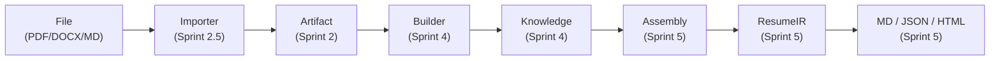

# ResumeOS

[English](README.md) | [中文](README.zh-CN.md)

> **Career Knowledge OS — Build your career once, project it anywhere.**

[](LICENSE)
[](tests/)
[](https://www.python.org/)
[](docs/decisions/)
[](scripts/)
[](runtime/)

---

## What is ResumeOS?

ResumeOS is **not** a resume generator. It is a **Career Knowledge OS** — a system where the knowledge base is the product, and a resume is just one of many projections.

You maintain a single, living knowledge base: an [Obsidian](https://obsidian.md) vault of Markdown files that capture every project, role, research result, competition, award, skill, and application across your entire career. This vault is the single source of truth. Everything else — resume, cover letter, interview prep pack, portfolio, personal website — is a **projection** derived from it.

The core principle: **build once, project anywhere.** You never edit a derived document directly. You update the knowledge base, and the system regenerates whatever you need on demand. This keeps the system honest, consistent, and hallucination-free.

The Python runtime (`runtime/`) implements this pipeline end-to-end. A set of modular Skills (`skills/`) orchestrate it from Claude Code or OpenCode. The runtime is LLM-agnostic — it has zero LLM imports and supports any provider through a pluggable adapter layer.

---

## The inversion

ResumeOS flips the relationship between your career data and the documents you produce:

| Traditional tool | ResumeOS |
|---|---|
| Form to resume | Vault to everything |
| One resume at a time | One vault, infinite projections |
| Data lives in the app | Data lives in Markdown you own |
| AI hallucinates to fill gaps | AI only uses confirmed vault facts |
| Tied to one LLM provider | LLM-agnostic runtime, swap any provider |
| Monolithic | Plugin-based: every Skill installable/removable |
| Snapshot | Career-long operating system |

---

## The core chain

This is the implemented pipeline — every stage is working code, tested with 407 passing tests:



**Stage by stage:**

1. **File** — Raw career material (PDF, DOCX, Markdown, Git log, image EXIF) enters through `vault/inbox/`.
2. **Importer** — A 5-layer pipeline (Detector, Extractor, Normalizer, Registry, Pipeline) parses files without any LLM calls.
3. **Artifact** — An immutable, typed representation of the extracted content with provenance metadata.
4. **Builder** — An LLM-powered pipeline (Planner, Retriever, LLM Provider, Validator, Merger) enriches artifacts into structured knowledge.
5. **Knowledge** — Immutable KnowledgeObjects with full provenance (who generated, which LLM, which prompt, from which artifact, when).
6. **Assembly** — Selects and ranks knowledge entries against a job description, then lays them out into a ResumeIR.
7. **ResumeIR** — An intermediate representation that renders to Markdown, JSON Resume, or HTML through pluggable renderers.

---

## Quick start

```bash
git clone https://github.com/MDSIXONE/ResumeOS.git
cd ResumeOS
pip install -r scripts/requirements.txt
python scripts/demo_sprint5.py    # Full pipeline: JD -> tailored resume
```

### All five demos

| Demo | Command | What it does |
|---|---|---|
| Sprint 1 | `python scripts/demo_sprint1.py` | Event Bus + Knowledge Index + Memory (runtime smoke test) |
| Sprint 2.5 | `python scripts/demo_sprint25.py` | Importer: README to Artifact (zero-AI file parsing) |
| Sprint 3 | `python scripts/demo_sprint3.py` | Inbox: batch import 3 files, artifacts, events, receipts, archive, replay |
| Sprint 4 | `python scripts/demo_sprint4.py` | Career Builder: Artifact to Knowledge (DummyLLM, provenance, conflict detection) |
| Sprint 5 | `python scripts/demo_sprint5.py` | Resume Assembly: JD to Selector to Ranker to ResumeIR to 3 files (MD/JSON/HTML) |

Each demo is self-contained and runs against local fixtures — no API keys, no network, no LLM provider required.

---

## Architecture

Six stable layers, each introduced in a specific sprint:

| Layer | Modules | Status |
|---|---|---|
| **Runtime** | `EventBus`, `KnowledgeIndex`, `Workflow`, `Memory`, `Transaction`, `Replay` | Stable (Sprint 1+3) |
| **Data** | `Artifact`, `KnowledgeObject`, `Draft`, `Conflict`, `Provenance`, `Writer` | Stable (Sprint 2+4) |
| **Parser** | 5-layer Importer pipeline (`Detector` to `Extractor` to `Normalizer`) | Stable (Sprint 2.5) |
| **Orchestration** | Inbox Orchestrator, `ImportReceipt`, Replay | Stable (Sprint 3) |
| **Generation** | Builder pipeline (`Plan` to `Retrieve` to `LLM` to `Draft` to `Validate` to `Merge` to `Write`) | Stable (Sprint 4) |
| **Projection** | Assembly (`Select` to `Rank` to `Layout` to `ResumeIR` to `Render`) | Stable (Sprint 5) |

---

## Repository layout

<details>
<summary><strong>Full directory tree</strong></summary>

```
ResumeOS/
├── runtime/                    # Python runtime (LLM-agnostic, zero LLM imports)
│   ├── event_bus.py            #   Pub/sub event system
│   ├── knowledge_index.py      #   Fast vault search
│   ├── workflow.py             #   DAG workflow engine
│   ├── memory.py               #   Conversation memory
│   ├── transaction.py          #   Atomic multi-step operations
│   ├── replay.py               #   Deterministic replay from event log
│   ├── receipt.py              #   Import receipts
│   ├── dispatcher.py           #   Skill dispatcher
│   ├── llm_provider.py         #   LLM provider interface (abstract)
│   ├── artifacts/              #   Artifact types and base classes
│   ├── importer/               #   5-layer importer pipeline
│   │   └── extractors/         #     PDF, DOCX, Git log, image EXIF, README parsers
│   ├── inbox/                  #   Inbox orchestrator and state machine
│   ├── knowledge/              #   Knowledge objects, provenance, drafts, conflicts, writer
│   ├── builder/                #   Builder pipeline (planner, retriever, validator, merger)
│   └── resume/                 #   Resume assembly pipeline
│       └── renderer/           #     Markdown, JSON Resume, HTML renderers
├── adapters/                   # External provider adapters
│   └── llm/
│       └── dummy.py            #   DummyLLMProvider (testing, no API key needed)
├── sdk/                        # Language SDKs
│   └── python/
│       └── skill.py            #   Skill base class
├── skills/                     # AI Skill plugins (Claude Code / OpenCode)
│   ├── career_collector/       #   Ingest raw material into vault/inbox
│   ├── career_builder/         #   Enrich vault, detect gaps, generate STAR stories
│   ├── resume_builder/         #   Generate master resume from vault
│   ├── resume_tailoring/       #   Tailor resume to a specific JD
│   ├── cover_letter/           #   Generate personalized cover letters
│   ├── interview/              #   Generate interview prep packs
│   ├── resume_review/          #   Review any resume (ATS/recruiter/HM/tech)
│   ├── job_tracker/            #   Track applications, interviews, offers
│   ├── career_update/          #   Watch vault for changes, trigger regeneration
│   └── registry.yaml           #   Skill registry and version pins
├── vault/                      # The Obsidian vault (the knowledge base)
│   ├── career/                 #   Entity notes (projects, research, education, skills, ...)
│   ├── jobs/                   #   Job application tracking notes
│   ├── inbox/                  #   Raw imports awaiting processing
│   ├── canvas/                 #   Career-graph Canvas files
│   └── daily/  periodic/       #   Review notes
├── templates/                  # Obsidian Templater templates for every entity type
├── prompts/                    # Modular, composable prompt fragments
├── schemas/                    # JSON Schema for every entity, manifest, and artifact
├── workflows/                  # Workflow definitions (YAML)
├── docs/
│   ├── architecture/           #   C4 model, data-flow diagrams
│   ├── decisions/              #   Architecture Decision Records (ADR-0000..0020)
│   ├── guides/                 #   Skill authoring, plugin dev, schema extension, MCP, Obsidian
│   ├── runtime/                #   Runtime module documentation
│   └── ux/                     #   UX specifications
├── tests/
│   ├── unit/                   #   Unit tests for every runtime module
│   ├── integration/            #   End-to-end pipeline tests
│   ├── golden/                 #   Golden-file regression tests
│   ├── contracts/              #   Skill behavior contracts
│   └── fixtures/               #   Test fixtures
├── scripts/
│   ├── demo_sprint1.py         #   Runtime smoke test
│   ├── demo_sprint25.py        #   Importer demo
│   ├── demo_sprint3.py         #   Inbox orchestrator demo
│   ├── demo_sprint4.py         #   Career builder demo
│   ├── demo_sprint5.py         #   Resume assembly demo
│   ├── requirements.txt        #   Python dependencies
│   └── validate-vault.py       #   Vault schema validator
├── examples/                   # Example vault + derived outputs
├── .github/workflows/          # CI pipeline
├── resumeos.config.yaml        # Central configuration
├── plugin.json                 # Root Skill bundle manifest
├── conftest.py                 # Pytest configuration
├── pytest.ini                  # Pytest settings
├── CONTRIBUTING.md
├── ROADMAP.md
├── LICENSE                     # MIT
└── README.md
```

</details>

> **Naming clarity:** `skills/` holds AI Skill *plugins*. `vault/career/skills/` holds notes about *your* competencies. They are different things; see [`docs/guides/obsidian-setup.md`](docs/guides/obsidian-setup.md).

---

## Core principles

- **Knowledge base first.** The vault is the single source of truth. Derived documents are reproducible artifacts, never the canonical store.
- **Never edit derived files.** Update the vault, regenerate. Tailoring produces ResumeIR, never mutates the knowledge base.
- **Anti-hallucination.** Skills never fabricate projects, metrics, awards, responsibilities, experience, skills, technologies, or numbers. When facts are missing, the Skill asks.
- **LLM-agnostic runtime.** The `runtime/` package has zero LLM imports — enforced by CI. Any provider plugs in through `adapters/llm/`.
- **Every KB entry is traceable.** Each KnowledgeObject carries full provenance: `generated_by`, `llm`, `prompt`, `artifact`, and `timestamp`.
- **Artifact is immutable.** No Skill may modify an Artifact after creation. Skills can only create new Knowledge from existing Artifacts.
- **Modular and plugin-based.** Every Skill is independently installable, removable, and replaceable. New Skills extend the system without modifying the core.
- **Prompts separated from logic.** `prompts/` holds composable prompt fragments; `SKILL.md` holds orchestration. Schemas are separated from templates.
- **Open standards.** Markdown, YAML frontmatter, JSON Schema, JSON Resume, JSON Canvas, Mermaid, Git.

---

## The 9 Skills

Every Skill is a self-contained plugin: a `SKILL.md` (Agent Skill standard), a `plugin.json` manifest, and a set of modular prompts under `prompts/`. These are Claude Code / OpenCode Skill plugins that orchestrate the Python runtime. Install one, install all, or write your own without touching the core.

<details>
<summary><strong>Full Skill reference</strong></summary>

| Skill | Reads | Writes | Purpose |
|---|---|---|---|
| `career_collector` | PDF, DOCX, MD, GitHub, LinkedIn export, images, certs | `vault/inbox/` | Collect raw career material, stage it for enrichment |
| `career_builder` | `vault/inbox/`, `vault/career/*` | `vault/career/*` | Build the knowledge graph, detect gaps, ask follow-ups, generate STAR stories, ATS keywords, interview questions |
| `resume_builder` | `vault/career/*` | derived resume | Generate a master resume (CN/EN, academic/industry, one/two-page, MD/DOCX/LaTeX/JSON Resume) |
| `resume_tailoring` | `vault/career/*` + a JD | derived tailored resume | Checkpoint-based phased pipeline: research, gap, assembly, generation, library update |
| `cover_letter` | `vault/career/*` + a JD | derived cover letter | Personalized cover letters grounded in confirmed facts |
| `interview` | `vault/career/*` + optional JD | derived prep pack | Behavior / technical / project questions, STAR answers, follow-ups, weakness analysis, mock interview |
| `resume_review` | any resume (vault or external) | review report | ATS / recruiter / hiring-manager / tech-lead review with actionable suggestions |
| `job_tracker` | `vault/jobs/*` | `vault/jobs/*` + dashboards | Track applications, interviews, offers, rejections, feedback, timeline |
| `career_update` | vault file-watch events | `vault/career/*` | Detect new files, enrich them, ask follow-ups, trigger regeneration of derived docs |

</details>

See [`docs/guides/skill-authoring-spec.md`](docs/guides/skill-authoring-spec.md) to build your own.

---

## Documentation

| Document | Description |
|---|---|
| [Architecture overview](docs/architecture/README.md) | C4 model, system context, container diagrams |
| [Data flow](docs/architecture/data-flow.md) | End-to-end data flow through the pipeline |
| [Architecture Decision Records](docs/decisions/) | ADR-0000 through ADR-0020 |
| [Runtime docs](docs/runtime/) | Runtime module reference |
| [UX specifications](docs/ux/) | User experience design documents |
| [Skill authoring spec](docs/guides/skill-authoring-spec.md) | How to build a new Skill |
| [Plugin development guide](docs/guides/plugin-development.md) | Hook system, permissions, namespace isolation |
| [Schema extension guide](docs/guides/schema-extension.md) | How to extend entity schemas |
| [MCP integration guide](docs/guides/mcp-integration.md) | Connecting external tools via MCP |
| [Obsidian setup guide](docs/guides/obsidian-setup.md) | Recommended plugins and vault configuration |
| [Testing strategy](tests/README.md) | Test structure, golden files, contracts |
| [Deployment guide](DEPLOYMENT.md) | Step-by-step setup and installation |
| [Roadmap](ROADMAP.md) | Development phases and what is next |
| [Contributing](CONTRIBUTING.md) | How to contribute |

---

## Contributing

See [`CONTRIBUTING.md`](CONTRIBUTING.md) for the full guide. In short: fork, branch, keep commits atomic, run `pytest` locally, and open a PR with the checklist filled in.

---

## License

MIT. See [LICENSE](LICENSE).
