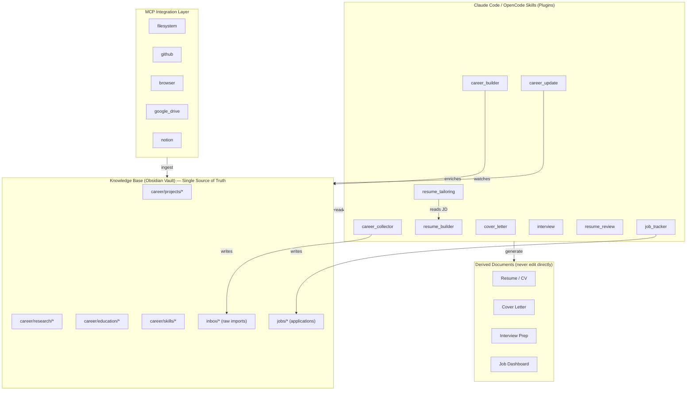

# ResumeOS

> An AI-native **Career Operating System** built around an Obsidian knowledge base.
> The vault is the single source of truth. Everything else — resume, cover letter, interview prep, portfolio — is **derived**.

[](LICENSE)
[](ROADMAP.md)
[](skills/registry.yaml)
[](docs/decisions/)

---

## What is ResumeOS?

ResumeOS is **not** a resume generator. It is a long-term, personal **career operating system**.

You keep one living knowledge base (an [Obsidian](https://obsidian.md) vault) that captures every
project, role, research, competition, award, skill, and application across your entire career.
A set of modular **Claude Code / OpenCode Skills** read that vault and derive whatever you need:

- a tailored resume for a specific job,
- a personalized cover letter,
- an interview preparation pack with STAR answers,
- a review of an existing resume,
- a dashboard of your job applications.

**Never edit derived documents directly. Always update the knowledge base.** Everything else is
regenerated from the vault on demand. This is the core philosophy and the single rule that keeps
the system honest, consistent, and hallucination-free.

---

## Why?

Most resume tools are **generators**: you type, they format. They hold your career in a form-bound
silo that dies the moment you close the tab. Reactive Resume and OpenResume are beautiful, but they
own your data. JSON Resume gives you portable data, but no intelligence. Resume Matcher scores a
resume against a job, but does not manage your career.

ResumeOS inverts the relationship:

| Traditional tool | ResumeOS |
|---|---|
| Form → resume | Vault → everything |
| One resume at a time | One vault, infinite resumes |
| Data lives in the app | Data lives in Markdown you own |
| AI hallucinates to fill gaps | AI only uses confirmed vault facts |
| Monolithic | Plugin-based: every Skill installable/removable |
| Snapshot | Career-long operating system |

---

## Architecture in one diagram



See [`docs/architecture/`](docs/architecture/README.md) for the full C4 model and data-flow diagrams.

---

## Repository layout

```
ResumeOS/
├── skills/            # AI Skill plugins (each independently installable)
│   ├── career_collector/      # Ingest PDF/DOCX/GitHub/LinkedIn → vault/inbox
│   ├── career_builder/        # Enrich vault, detect gaps, ask follow-ups
│   ├── resume_builder/        # Generate master resume from the vault
│   ├── resume_tailoring/      # Tailor a resume to a specific JD (phased pipeline)
│   ├── cover_letter/          # Generate personalized cover letters
│   ├── interview/             # Generate interview prep + STAR + mock interview
│   ├── resume_review/         # Review any resume (ATS/recruiter/HM/tech)
│   ├── job_tracker/           # Track applications, interviews, offers
│   ├── career_update/         # Watch vault for new files → enrich → regenerate
│   └── registry.yaml          # Skill registry & version pins
├── vault/            # The Obsidian vault (the database)
│   ├── career/{projects,research,competitions,internships,opensource,awards,education,skills}/
│   ├── jobs/                  # Job application notes
│   ├── inbox/                 # Raw imports awaiting career_collector/career_builder
│   ├── canvas/                # Career-graph Canvas files (.canvas)
│   ├── daily/  periodic/      # Daily & periodic review notes
│   └── README.md              # Vault guide
├── templates/        # Obsidian Templater templates for every entity type
├── prompts/          # Modular, composable prompt files consumed by Skills
├── schemas/          # JSON Schema for every entity (validates frontmatter)
├── docs/
│   ├── architecture/          # C4 + data-flow + plugin model
│   ├── decisions/             # Architecture Decision Records (ADR-0000…0010)
│   └── guides/                # Skill authoring, plugin dev, schema extension, MCP, Obsidian setup
├── examples/         # A complete example vault + derived outputs
├── tests/            # Schema-validation tests + Skill behavior contracts
├── .github/workflows/# CI: validate schemas, validate example vault, lint frontmatter
├── resumeos.config.yaml       # Central configuration
├── plugin.json                # Root Claude-Code plugin manifest
├── CONTRIBUTING.md  ROADMAP.md  LICENSE
└── README.md
```

> **Naming clarity:** `skills/` = AI Skill *plugins*. `vault/career/skills/` = notes about *your*
> competencies. They are different things; the distinction is documented in
> [`docs/guides/obsidian-setup.md`](docs/guides/obsidian-setup.md).

---

## The Skills

Every Skill is a self-contained plugin: a `SKILL.md` (Agent Skill standard), a `plugin.json`
manifest, and a set of modular prompts under `prompts/`. Install one, install all, or write your own
without touching the core.

| Skill | Reads | Writes | Purpose |
|---|---|---|---|
| `career_collector` | PDF, DOCX, MD, GitHub, LinkedIn export, images, certs | `vault/inbox/` | Collect raw career material, stage it for enrichment |
| `career_builder` | `vault/inbox/`, `vault/career/*` | `vault/career/*` | Build the knowledge graph, detect gaps, ask follow-ups, generate STAR stories, ATS keywords, interview questions |
| `resume_builder` | `vault/career/*` | derived resume | Generate a master resume (CN/EN, academic/industry, one/two-page, MD/DOCX/LaTeX/JSON Resume) |
| `resume_tailoring` | `vault/career/*` + a JD | derived tailored resume | Checkpoint-based phased pipeline: research → gap → assembly → generation → library update |
| `cover_letter` | `vault/career/*` + a JD | derived cover letter | Personalized cover letters grounded in confirmed facts |
| `interview` | `vault/career/*` + optional JD | derived prep pack | Behavior / technical / project questions, STAR answers, follow-ups, weakness analysis, mock interview |
| `resume_review` | any resume (vault or external) | review report | ATS / recruiter / hiring-manager / tech-lead review with actionable suggestions |
| `job_tracker` | `vault/jobs/*` | `vault/jobs/*` + dashboards | Track applications, interviews, offers, rejections, feedback, timeline |
| `career_update` | vault file-watch events | `vault/career/*` | Detect new files, enrich them, ask follow-ups, trigger regeneration of derived docs |

See [`docs/guides/skill-authoring-spec.md`](docs/guides/skill-authoring-spec.md) to build your own.

---

## Quick start

1. **Open the vault.** Open `vault/` in Obsidian. Install the recommended plugins (see
   `docs/guides/obsidian-setup.md`): Dataview, Templater, QuickAdd, Canvas, Excalidraw, Periodic Notes.
2. **Create entities from templates.** Use the Templater templates in `templates/` to create project,
   education, skill, award, and job-application notes. Every note is one entity with YAML frontmatter
   validated against `schemas/`.
3. **Install the Skills.** Point Claude Code / OpenCode at `skills/` (or symlink individual skills
   into your `.claude/skills/`). The root `plugin.json` registers the bundle.
4. **Collect → Build → Derive.** Drop raw material into `vault/inbox/`, run `career_collector`, then
   `career_builder` to enrich the vault, then `resume_builder` / `resume_tailoring` /
   `interview` / `cover_letter` to derive what you need.
5. **Track applications.** Use `job_tracker` + `templates/job-application.md` to manage the pipeline.

---

## Core principles

- **Knowledge base first.** The vault is the single source of truth. Derived documents are
  reproducible artifacts, never the canonical store.
- **Never edit derived files.** Update the vault, regenerate.
- **Anti-hallucination.** Skills never fabricate projects, metrics, awards, responsibilities,
  experience, skills, technologies, or numbers. When facts are missing, the Skill **asks**.
- **Modular & plugin-based.** Every Skill is independently installable, removable, and replaceable.
  New Skills extend the system without modifying the core.
- **Prompts separated from logic.** `prompts/` holds composable prompt fragments; `SKILL.md` holds
  orchestration. Schemas are separated from templates.
- **Open standards.** Markdown, YAML frontmatter, JSON Schema, JSON Resume, JSON Canvas, Mermaid, Git.

---

## Documentation

- [Architecture overview](docs/architecture/README.md)
- [Data flow](docs/architecture/data-flow.md)
- [Architecture Decision Records](docs/decisions/) (ADR-0000…0010)
- [Skill authoring spec](docs/guides/skill-authoring-spec.md)
- [Plugin development guide](docs/guides/plugin-development.md)
- [Schema extension guide](docs/guides/schema-extension.md)
- [MCP integration guide](docs/guides/mcp-integration.md)
- [Obsidian setup guide](docs/guides/obsidian-setup.md)
- [Testing strategy](tests/README.md)
- [Roadmap](ROADMAP.md)
- [Contributing](CONTRIBUTING.md)

---

## License

MIT © see [LICENSE](LICENSE).
