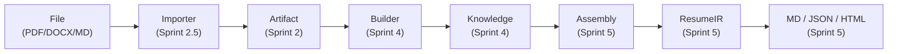

# ResumeOS

[English](README.md) | [中文](README.zh-CN.md)

> **职业知识操作系统 —— 构建一次你的职业生涯，投影到任何需要的地方。**

[](LICENSE)
[](tests/)
[](https://www.python.org/)
[](docs/decisions/)
[](scripts/)
[](runtime/)

---

## ResumeOS 是什么？

ResumeOS **不是**简历生成器。它是一个**职业知识操作系统** —— 一个以知识库为核心产品的系统，简历只是众多投影中的一种。

你维护一个唯一的、持续生长的知识库：一个 [Obsidian](https://obsidian.md) Vault，其中的 Markdown 文件记录了你整个职业生涯中的每个项目、岗位、研究成果、竞赛、奖项、技能和求职经历。这个 Vault 是**唯一可信源**。其他一切 —— 简历、求职信、面试准备包、作品集、个人网站 —— 都是从它**投影**出来的派生物。

核心原则：**构建一次，投影到任何需要的地方。** 你永远不会直接编辑派生文档。你更新知识库，系统按需重新生成你需要的一切。这保证了系统的真实性、一致性和无幻觉。

Python 运行时 (`runtime/`) 端到端地实现了这条流水线。一组模块化的 Skill (`skills/`) 通过 Claude Code 或 OpenCode 来编排它。运行时是 LLM 无关的 —— 它没有任何 LLM 导入，通过可插拔的适配器层支持任何提供商。

---

## 关系反转

ResumeOS 颠倒了你的职业数据和产出文档之间的关系：

| 传统工具 | ResumeOS |
|---|---|
| 表单 -> 简历 | Vault -> 一切 |
| 一次只能做一份简历 | 一个 Vault，无限投影 |
| 数据存在应用里 | 数据存在你拥有的 Markdown 里 |
| AI 猜测来填补空白 | AI 只使用 Vault 中已确认的事实 |
| 绑定一个 LLM 提供商 | LLM 无关运行时，随意切换提供商 |
| 单体架构 | 插件化：每个 Skill 可独立安装/卸载 |
| 快照式 | 覆盖整个职业生涯的操作系统 |

---

## 核心链路

这是已实现的流水线 —— 每个阶段都是可运行的代码，通过 407 个测试验证：



**逐阶段说明：**

1. **File** —— 原始职业材料（PDF、DOCX、Markdown、Git 日志、图片 EXIF）通过 `vault/inbox/` 进入系统。
2. **Importer** —— 5 层流水线（Detector、Extractor、Normalizer、Registry、Pipeline）解析文件，不调用任何 LLM。
3. **Artifact** —— 不可变的、带类型的提取内容表示，附带来源元数据。
4. **Builder** —— 由 LLM 驱动的流水线（Planner、Retriever、LLM Provider、Validator、Merger），将 Artifact 充实为结构化的 Knowledge。
5. **Knowledge** —— 不可变的 KnowledgeObject，带有完整的来源信息（谁生成的、用了哪个 LLM、哪个 prompt、来自哪个 Artifact、什么时间）。
6. **Assembly** —— 根据职位描述筛选和排序 Knowledge 条目，然后将其排版为 ResumeIR。
7. **ResumeIR** —— 一种中间表示，通过可插拔的渲染器输出为 Markdown、JSON Resume 或 HTML。

---

## 快速开始

```bash
git clone https://github.com/MDSIXONE/ResumeOS.git
cd ResumeOS
pip install -r scripts/requirements.txt
python scripts/demo_sprint5.py    # 完整流水线：JD -> 定制简历
```

### 全部五个 Demo

| Demo | 命令 | 功能说明 |
|---|---|---|
| Sprint 1 | `python scripts/demo_sprint1.py` | Event Bus + Knowledge Index + Memory（运行时冒烟测试） |
| Sprint 2.5 | `python scripts/demo_sprint25.py` | Importer：README -> Artifact（零 AI 文件解析） |
| Sprint 3 | `python scripts/demo_sprint3.py` | Inbox：批量导入 3 个文件，生成 Artifact、事件、回执、归档、重放 |
| Sprint 4 | `python scripts/demo_sprint4.py` | Career Builder：Artifact -> Knowledge（DummyLLM、来源追踪、冲突检测） |
| Sprint 5 | `python scripts/demo_sprint5.py` | Resume Assembly：JD -> Selector -> Ranker -> ResumeIR -> 3 个文件（MD/JSON/HTML） |

每个 Demo 都是自包含的，使用本地测试数据运行 —— 无需 API 密钥，无需网络，无需 LLM 提供商。

---

## 架构

六个稳定层，每个层在特定的 Sprint 中引入：

| 层 | 模块 | 状态 |
|---|---|---|
| **Runtime** | `EventBus`、`KnowledgeIndex`、`Workflow`、`Memory`、`Transaction`、`Replay` | 稳定（Sprint 1+3） |
| **Data** | `Artifact`、`KnowledgeObject`、`Draft`、`Conflict`、`Provenance`、`Writer` | 稳定（Sprint 2+4） |
| **Parser** | 5 层 Importer 流水线（`Detector` -> `Extractor` -> `Normalizer`） | 稳定（Sprint 2.5） |
| **Orchestration** | Inbox Orchestrator、`ImportReceipt`、Replay | 稳定（Sprint 3） |
| **Generation** | Builder 流水线（`Plan` -> `Retrieve` -> `LLM` -> `Draft` -> `Validate` -> `Merge` -> `Write`） | 稳定（Sprint 4） |
| **Projection** | Assembly（`Select` -> `Rank` -> `Layout` -> `ResumeIR` -> `Render`） | 稳定（Sprint 5） |

---

## 仓库结构

<details>
<summary><strong>完整目录树</strong></summary>

```
ResumeOS/
├── runtime/                    # Python 运行时（LLM 无关，零 LLM 导入）
│   ├── event_bus.py            #   发布/订阅事件系统
│   ├── knowledge_index.py      #   快速 Vault 搜索
│   ├── workflow.py             #   DAG 工作流引擎
│   ├── memory.py               #   对话记忆
│   ├── transaction.py          #   原子多步操作
│   ├── replay.py               #   基于事件日志的确定性重放
│   ├── receipt.py              #   导入回执
│   ├── dispatcher.py           #   Skill 调度器
│   ├── llm_provider.py         #   LLM 提供商接口（抽象）
│   ├── artifacts/              #   Artifact 类型和基类
│   ├── importer/               #   5 层 Importer 流水线
│   │   └── extractors/         #     PDF、DOCX、Git 日志、图片 EXIF、README 解析器
│   ├── inbox/                  #   Inbox 编排器和状态机
│   ├── knowledge/              #   Knowledge 对象、来源、草稿、冲突、写入器
│   ├── builder/                #   Builder 流水线（planner、retriever、validator、merger）
│   └── resume/                 #   Resume Assembly 流水线
│       └── renderer/           #     Markdown、JSON Resume、HTML 渲染器
├── adapters/                   # 外部提供商适配器
│   └── llm/
│       └── dummy.py            #   DummyLLMProvider（测试用，无需 API 密钥）
├── sdk/                        # 语言 SDK
│   └── python/
│       └── skill.py            #   Skill 基类
├── skills/                     # AI Skill 插件（Claude Code / OpenCode）
│   ├── career_collector/       #   采集原始材料到 vault/inbox
│   ├── career_builder/         #   充实 Vault、检测缺口、生成 STAR 故事
│   ├── resume_builder/         #   从 Vault 生成主简历
│   ├── resume_tailoring/       #   针对特定 JD 定制简历
│   ├── cover_letter/           #   生成个性化求职信
│   ├── interview/              #   生成面试准备包
│   ├── resume_review/          #   审查简历（ATS/招聘官/用人经理/技术负责人）
│   ├── job_tracker/            #   跟踪求职申请、面试、Offer
│   ├── career_update/          #   监听 Vault 变更，触发重新生成
│   └── registry.yaml           #   Skill 注册表和版本锁定
├── vault/                      # Obsidian Vault（知识库）
│   ├── career/                 #   实体笔记（项目、研究、教育、技能……）
│   ├── jobs/                   #   求职申请跟踪笔记
│   ├── inbox/                  #   等待处理的原始导入
│   ├── canvas/                 #   职业图谱 Canvas 文件
│   └── daily/  periodic/       #   复盘笔记
├── templates/                  # Obsidian Templater 模板（每种实体类型一个）
├── prompts/                    # 模块化、可组合的 prompt 片段
├── schemas/                    # JSON Schema（每个实体、清单、Artifact）
├── workflows/                  # 工作流定义（YAML）
├── docs/
│   ├── architecture/           #   C4 模型、数据流图
│   ├── decisions/              #   架构决策记录（ADR-0000..0020）
│   ├── guides/                 #   Skill 开发、插件开发、Schema 扩展、MCP、Obsidian
│   ├── runtime/                #   运行时模块文档
│   └── ux/                     #   UX 规格说明
├── tests/
│   ├── unit/                   #   每个运行时模块的单元测试
│   ├── integration/            #   端到端流水线测试
│   ├── golden/                 #   黄金文件回归测试
│   ├── contracts/              #   Skill 行为契约
│   └── fixtures/               #   测试数据
├── scripts/
│   ├── demo_sprint1.py         #   运行时冒烟测试
│   ├── demo_sprint25.py        #   Importer 演示
│   ├── demo_sprint3.py         #   Inbox 编排器演示
│   ├── demo_sprint4.py         #   Career Builder 演示
│   ├── demo_sprint5.py         #   Resume Assembly 演示
│   ├── requirements.txt        #   Python 依赖
│   └── validate-vault.py       #   Vault Schema 校验器
├── examples/                   # 示例 Vault + 派生产出
├── .github/workflows/          # CI 流水线
├── resumeos.config.yaml        # 全局配置
├── plugin.json                 # 根 Skill 包清单
├── conftest.py                 # Pytest 配置
├── pytest.ini                  # Pytest 设置
├── CONTRIBUTING.md
├── ROADMAP.md
├── LICENSE                     # MIT
└── README.md
```

</details>

> **命名说明：** `skills/` 存放的是 AI Skill *插件*。`vault/career/skills/` 存放的是关于你*个人能力*的笔记。它们是不同的东西；详见 [`docs/guides/obsidian-setup.md`](docs/guides/obsidian-setup.md)。

---

## 核心原则

- **知识库优先。** Vault 是唯一可信源。派生文档是可重现的产物，永远不是权威存储。
- **永不直接编辑派生文件。** 更新 Vault，重新生成。定制过程产出 ResumeIR，永远不会修改知识库。
- **反幻觉。** Skill 绝不捏造项目、指标、奖项、职责、经历、技能、技术或数字。当事实缺失时，Skill 会主动询问。
- **LLM 无关运行时。** `runtime/` 包没有任何 LLM 导入 —— 由 CI 强制执行。任何提供商都通过 `adapters/llm/` 接入。
- **每个 KB 条目可追溯。** 每个 KnowledgeObject 携带完整的来源信息：`generated_by`、`llm`、`prompt`、`artifact` 和 `timestamp`。
- **Artifact 不可变。** 任何 Skill 都不能在创建后修改 Artifact。Skill 只能从已有的 Artifact 创建新的 Knowledge。
- **模块化和插件化。** 每个 Skill 都可独立安装、卸载和替换。新 Skill 扩展系统而不修改核心。
- **Prompt 与逻辑分离。** `prompts/` 存放可组合的 prompt 片段；`SKILL.md` 存放编排逻辑。Schema 与模板分离。
- **开放标准。** Markdown、YAML frontmatter、JSON Schema、JSON Resume、JSON Canvas、Mermaid、Git。

---

## 9 个 Skill

每个 Skill 是一个自包含的插件：一个 `SKILL.md`（Agent Skill 标准）、一个 `plugin.json` 清单，以及 `prompts/` 下的一组模块化 prompt。这些是 Claude Code / OpenCode Skill 插件，负责编排 Python 运行时。可以安装一个、全部安装，或者在不触碰核心的情况下编写自己的 Skill。

<details>
<summary><strong>完整 Skill 参考</strong></summary>

| Skill | 读取 | 写入 | 用途 |
|---|---|---|---|
| `career_collector` | PDF、DOCX、MD、GitHub、LinkedIn 导出、图片、证书 | `vault/inbox/` | 采集原始职业材料，暂存待充实 |
| `career_builder` | `vault/inbox/`、`vault/career/*` | `vault/career/*` | 构建知识图谱、检测缺口、追问、生成 STAR 故事、ATS 关键词、面试问题 |
| `resume_builder` | `vault/career/*` | 派生简历 | 生成主简历（中/英、学术/行业、单/双页、MD/DOCX/LaTeX/JSON Resume） |
| `resume_tailoring` | `vault/career/*` + JD | 派生定制简历 | 基于检查点的分阶段流水线：调研、缺口分析、组装、生成、库更新 |
| `cover_letter` | `vault/career/*` + JD | 派生求职信 | 基于已确认事实的个性化求职信 |
| `interview` | `vault/career/*` + 可选 JD | 派生准备包 | 行为/技术/项目问题、STAR 回答、追问、弱点分析、模拟面试 |
| `resume_review` | 任何简历（Vault 内或外部） | 审查报告 | ATS / 招聘官 / 用人经理 / 技术负责人视角的审查和可执行建议 |
| `job_tracker` | `vault/jobs/*` | `vault/jobs/*` + 仪表盘 | 跟踪求职申请、面试、Offer、拒信、反馈、时间线 |
| `career_update` | Vault 文件监听事件 | `vault/career/*` | 检测新文件、充实内容、追问、触发派生文档重新生成 |

</details>

参见 [`docs/guides/skill-authoring-spec.md`](docs/guides/skill-authoring-spec.md) 了解如何构建自己的 Skill。

---

## 文档

| 文档 | 说明 |
|---|---|
| [架构概览](docs/architecture/README.md) | C4 模型、系统上下文、容器图 |
| [数据流](docs/architecture/data-flow.md) | 流水线端到端数据流 |
| [架构决策记录](docs/decisions/) | ADR-0000 至 ADR-0020 |
| [运行时文档](docs/runtime/) | 运行时模块参考 |
| [UX 规格说明](docs/ux/) | 用户体验设计文档 |
| [Skill 开发规范](docs/guides/skill-authoring-spec.md) | 如何构建新的 Skill |
| [插件开发指南](docs/guides/plugin-development.md) | Hook 系统、权限模型、命名空间隔离 |
| [Schema 扩展指南](docs/guides/schema-extension.md) | 如何扩展实体 Schema |
| [MCP 集成指南](docs/guides/mcp-integration.md) | 通过 MCP 连接外部工具 |
| [Obsidian 配置指南](docs/guides/obsidian-setup.md) | 推荐插件和 Vault 配置 |
| [测试策略](tests/README.md) | 测试结构、黄金文件、行为契约 |
| [部署指南](DEPLOYMENT.md) | 分步安装和配置 |
| [路线图](ROADMAP.md) | 开发阶段和后续计划 |
| [贡献指南](CONTRIBUTING.md) | 如何参与贡献 |

---

## 贡献

参见 [`CONTRIBUTING.md`](CONTRIBUTING.md) 了解完整指南。简而言之：Fork、建分支、保持原子提交、本地运行 `pytest`、填写 PR 清单后提交。

---

## 开源协议

MIT。详见 [LICENSE](LICENSE)。
