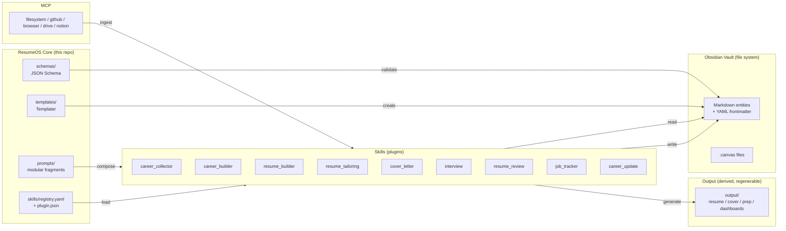
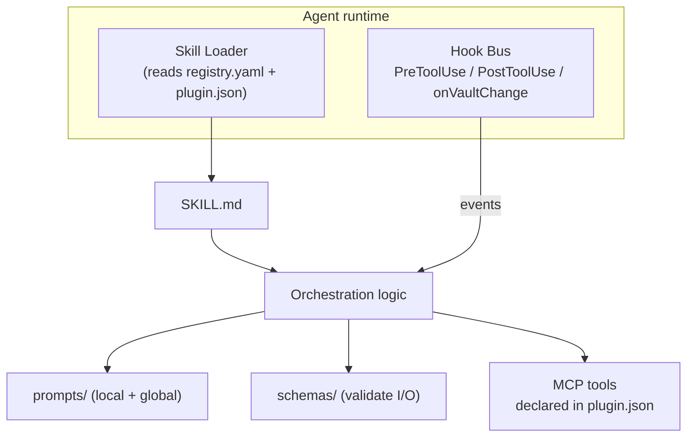

# ResumeOS Architecture

This document is the authoritative architecture reference. It uses the C4 model (Context →
Container → Component) plus a data-flow view, and it indexes every Architecture Decision Record
(ADR) that justifies a design choice.

> **Read first:** [ADR-0001 — Knowledge Base as Single Source of Truth](../decisions/ADR-0001-knowledge-base-as-single-source-of-truth.md).
> Every other decision flows from it.

---

## 1. System Context (C4 Level 1)

```mermaid
C4Context
    title ResumeOS — System Context

    person(user, "Career Owner", "Maintains one Obsidian vault across their whole career")
    system(resumeos, "ResumeOS", "AI-native career OS: vault + skills + MCP")
    system_Ext(obsidian, "Obsidian", "Local knowledge-base app (Dataview, Templater, Canvas)")
    system_Ext(agent, "Claude Code / OpenCode", "Agent runtime that executes Skills")
    system_Ext(mcp, "MCP Servers", "filesystem, github, browser, drive, notion")
    system_Ext(ats, "ATS / Employers", "Consume derived resumes & cover letters")

    Rel(user, resumeos, "Curates vault, runs skills")
    Rel(resumeos, obsidian, "Stores/reads markdown entities")
    Rel(resumeos, agent, "Registers Skills for execution")
    Rel(resumeos, mcp, "Ingests external data / researches companies")
    Rel(resumeos, ats, "Produces derived resumes/cover letters")
```

**Actors**

- **Career Owner** — the only user. Owns the vault. Runs Skills.
- **Obsidian** — the storage and navigation UI for the vault. ResumeOS does not replace it; it
  extends it with templates, Dataview queries, Canvas files, and Skills.
- **Claude Code / OpenCode** — the agent runtime. ResumeOS Skills are Agent-Skill-standard
  `SKILL.md` files that this runtime executes.
- **MCP servers** — optional external integrations. ResumeOS treats them as data sources/sinks, never
  as the source of truth.
- **ATS / Employers** — consumers of derived documents. They never touch the vault.

---

## 2. Container View (C4 Level 2)



**Key boundary rules**

| Boundary | Direction | Rule |
|---|---|---|
| Skills → Vault | write | Only enrichment writes (`career_collector`→`inbox`, `career_builder`/`career_update`→`career/*`, `job_tracker`→`jobs/*`). Never write derived docs into the vault. |
| Skills → Output | write | Derived documents go to `output/` only. They are regenerable and git-ignored. |
| Output → Vault | ✗ | Forbidden. Derived data must never flow back into the SSOT. |
| Skills ↔ Schemas | read | Skills validate every entity they read against `schemas/`. |
| MCP → Skills | push | MCP is a data source. It never owns state. |

---

## 3. Component View — the Skill plugin model (C4 Level 3)

Every Skill is a self-contained plugin with a fixed internal structure:

```
skills/<skill-name>/
├── SKILL.md            # Agent Skill standard: frontmatter + orchestration
├── plugin.json         # Manifest: name, version, deps, hooks, mcp_tools, permissions
├── prompts/            # Skill-local prompt fragments (compose global prompts/ too)
└── README.md           # User-facing doc for the skill
```



See [ADR-0004 — Plugin System Design](../decisions/ADR-0004-plugin-system-design.md) and
[ADR-0005 — Skill Internal Structure](../decisions/ADR-0005-skill-internal-structure.md).

---

## 4. Data Flow

See [data-flow.md](data-flow.md) for the full ingest → store → transform → render → export pipeline.

In one line:

```
raw material → career_collector → vault/inbox → career_builder → vault/career/*
   → {resume_builder | resume_tailoring | cover_letter | interview | resume_review}
   → output/ (derived, regenerable, never edited)
```

---

## 5. ADR Index

Every major design decision is recorded as an ADR. ADRs are immutable once Accepted; supersession
creates a new ADR that links back.

| ADR | Decision | Status |
|---|---|---|
| [0000](../decisions/ADR-0000-use-markdown-adrs.md) | Use Markdown Architectural Decision Records (MADR) | Accepted |
| [0001](../decisions/ADR-0001-knowledge-base-as-single-source-of-truth.md) | Knowledge base is the single source of truth | Accepted |
| [0002](../decisions/ADR-0002-schema-strategy.md) | JSON Schema superset of JSON Resume; strict frontmatter | Accepted |
| [0003](../decisions/ADR-0003-obsidian-vault-as-graph-database.md) | Obsidian vault as a graph database | Accepted |
| [0004](../decisions/ADR-0004-plugin-system-design.md) | Plugin-based Skills; manifest-first; namespace isolation | Accepted |
| [0005](../decisions/ADR-0005-skill-internal-structure.md) | Standard Skill internal structure (SKILL.md + plugin.json + prompts) | Accepted |
| [0006](../decisions/ADR-0006-checkpoint-phased-pipeline.md) | Checkpoint-based phased pipeline for tailoring & review | Accepted |
| [0007](../decisions/ADR-0007-anti-hallucination-contract.md) | Anti-hallucination contract: ask, never invent | Accepted |
| [0008](../decisions/ADR-0008-mcp-as-optional-adapter.md) | MCP servers are optional adapters, never the source of truth | Accepted |
| [0009](../decisions/ADR-0009-prompt-modularity.md) | Modular, composable prompt files separated from orchestration | Accepted |
| [0010](../decisions/ADR-0010-content-and-derived-separation.md) | Content (vault) and derived output live in different trees | Accepted |

---

## 6. Quality attributes & how the architecture serves them

| Attribute | Mechanism |
|---|---|
| **Data ownership / privacy** | Local-first vault; no cloud required; MCP optional; output git-ignored. |
| **No hallucination** | ADR-0007 contract enforced by every Skill; phases carry provenance. |
| **Extensibility** | Plugin-based Skills (ADR-0004); new skills don't touch core. |
| **Maintainability** | Prompts/logic/schemas/templates separated (ADR-0009, ADR-0002); ADRs record why. |
| **Portability** | Open formats: Markdown, YAML, JSON Schema, JSON Resume, JSON Canvas. |
| **Reproducibility** | Derived docs are functions of (vault, prompt version, config); versioned in Git. |
| **Auditability** | Each pipeline phase emits a validated JSON artifact (ADR-0006). |
