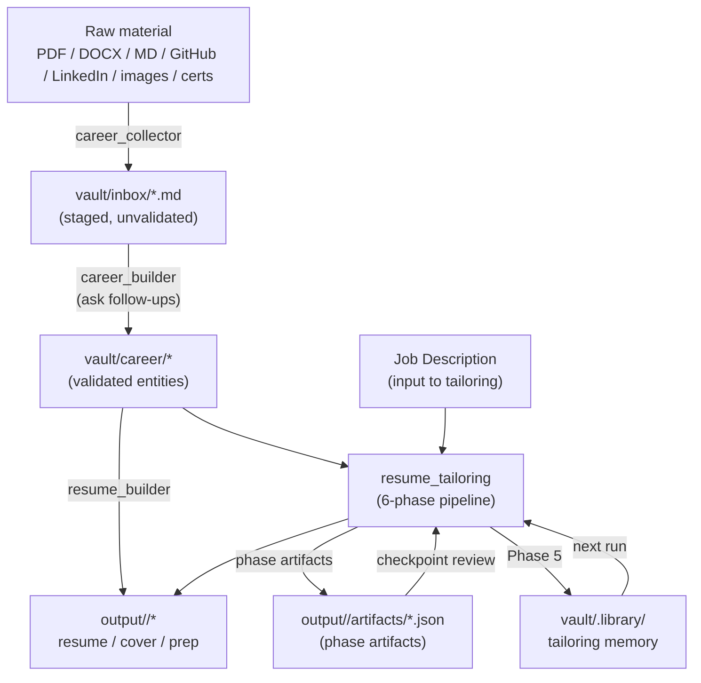
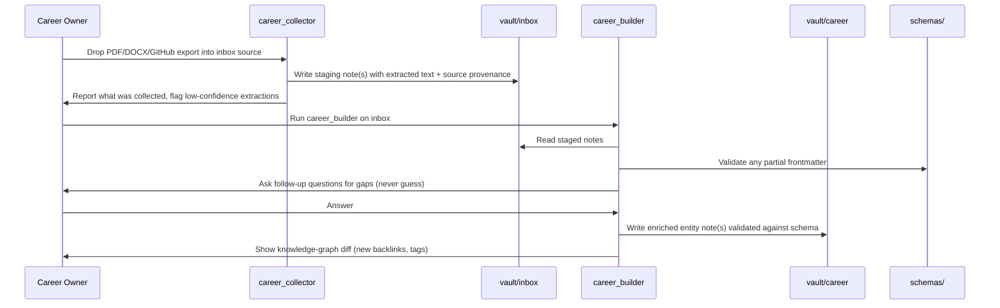
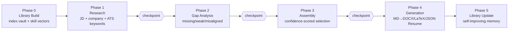
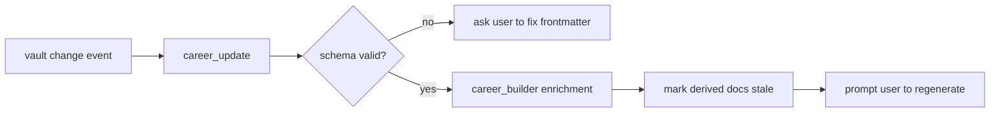

# Data Flow

How data moves through ResumeOS: from raw career material to a derived, job-tailored resume.
Every arrow below is a **validated** transition. Skills never pass unvalidated data between stages.

---

## 1. End-to-end pipeline

---

## 2. The ingest path (career_collector → career_builder)

**Provenance rule:** every entity created by `career_collector` records its source(s) in
`frontmatter.sources[]`. `career_builder` never removes provenance. This is the audit trail that
makes anti-hallucination enforceable (ADR-0007).

---

## 3. The tailoring path (resume_tailoring, 6 phases)

Adopted from the `resume-tailoring-skill` pattern and hardened with checkpoints
([ADR-0006](../decisions/ADR-0006-checkpoint-phased-pipeline.md)). Each phase emits a **validated
JSON artifact** so a phase can be re-run, audited, or checkpoint-reviewed independently.

| Phase | Input | Output artifact | Checkpoint? |
|---|---|---|---|
| 0 Library Build | `vault/career/*` | `library.json` (entity index + vectors) | no |
| 1 Research | JD, company | `research.json` (requirements, culture, ATS keywords) | **yes** |
| 2 Gap Analysis | library + research | `gaps.json` (missing/underdeveloped/misaligned) | **yes** |
| 3 Assembly | library + gaps | `assembly.json` (ranked projects, reworded bullets, scores) | **yes** |
| 4 Generation | assembly | `resume.md` + `resume.docx` + `resume.tex` + `resume.json` | no |
| 5 Library Update | assembly + feedback | `vault/.library/<job>.json` | no |

**Checkpoint contract:** at a checkpoint, the Skill pauses and presents the artifact for user review.
The next phase does **not** run until the user approves or edits the artifact. Phases are sequential
by design — parallel execution would make each phase "work blind" (ADR-0006).

---

## 4. The regeneration path (career_update)

`career_update` watches the vault. When a new file appears (or an entity changes), it:

1. Validates the file against its schema (infer entity type from folder).
2. Calls `career_builder` enrichment on it (ask follow-ups for gaps).
3. Marks derived documents that depended on this entity as **stale** (written to
   `output/.stale.json`).
4. Prompts the user to regenerate stale derived docs (does **not** auto-regenerate without consent).

---

## 5. What never happens

These flows are **forbidden** by the architecture and enforced by `plugin.json` permissions:

- Writing derived documents into the vault.
- Reading `output/` as input to any Skill (derived data is not a source of truth).
- A Skill inventing a fact not present in the vault (ADR-0007).
- MCP servers writing directly to the vault (they go through a Skill).
- Editing a derived file to "fix" it (fix the vault, then regenerate).
