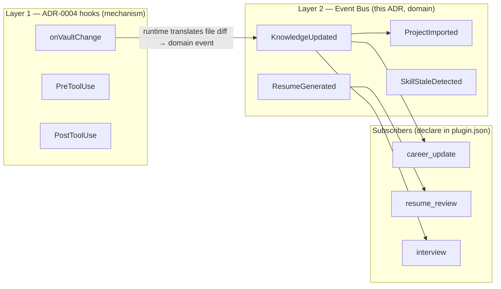

# ADR-0014: Event Bus — Domain Events Above Hooks

- **Status:** Accepted
- **Date:** 2026-06-29
- **Deciders:** ResumeOS lead, Runtime track
- **Related:** ADR-0001, ADR-0004, ADR-0007, ADR-0011, ADR-0012
- **Supersedes:** none
- **Superseded by:** none

## Context

ADR-0004 defines a Tier-2 hook bus with file/tool-lifecycle hooks: `vault.import`,
`vault.export`, `vault.transform`, `vault.validate`, `vault.render`, `onVaultChange`,
`PreToolUse`, `PostToolUse`. These are **mechanism-level**: "a vault file changed," "a tool is
about to run." They carry no domain semantics — `onVaultChange` fires identically whether a
new project note was created, a skill's `last_used` was bumped, or a typo was fixed.

As Skills multiply, they need to react to **domain happenings** — "a project was imported,"
"knowledge was updated," "a resume was generated," "a gap was detected." Today the only ways
to achieve this are:

1. **Each Skill polls the vault** — O(n) repeated scans, and Skills re-derive domain semantics
   from file diffs independently (drift, duplication).
2. **One Skill directly calls another** — `inbox_ingest` calls `career_collector` calls
   `career_builder` calls `career_update`. This couples Skills tightly: replacing or removing
   one breaks its callers, violating ADR-0004's "new Skills extend without modifying core" and
   "independently installable/removable." A community Skill cannot subscribe to a built-in
   Skill's outputs without the built-in Skill knowing about it.

The reference projects confirmed this: nishilbhave/ats-resume-tailor found that parallel agents
that "each work blind" fail; a sequential pipeline with clear handoffs works. But direct calls
make the pipeline a rigid chain. An event bus turns the chain into a graph where publishers and
subscribers are ignorant of each other.

The Phase 2 UX design already implies domain events without naming them: `career_update` "fires
on the `onVaultChange` hook to refresh stale flags"; `resume_review` should react to
`ResumeGenerated`; the dashboard should react to `ImportCompleted`. This ADR makes the layer
explicit.

## Decision

Add a **domain Event Bus** as a layer **above** ADR-0004 hooks. Hooks are the mechanism
(filesystem/tool lifecycle); events are the semantics (what happened in the career domain).
The two coexist; this ADR does not replace hooks.

### Two-layer model

- **Layer 1 (unchanged):** `onVaultChange` fires on any vault file change. `PreToolUse` /
  `PostToolUse` fire around tool calls. These remain the low-level extension points per
  ADR-0004.
- **Layer 2 (this ADR):** the runtime inspects a hook firing and emits a **domain event** with
  a typed payload. E.g. `onVaultChange` on `vault/career/projects/px4-uav.md` (file created) →
  the runtime emits `ProjectImported{entity_id: "px4-uav", path: ...}`. Skills subscribe to
  domain events, not raw hooks.

### Event lifecycle

1. **Publish.** A Skill or the runtime calls `bus.emit(EventType, payload)`. Publishers do not
   know who (if anyone) is listening.
2. **Persist.** Every event appends to `vault/.library/events.jsonl` (audit log, git-ignored,
   rebuildable from vault state + import logs). This is the durable record; in-process delivery
   is the fast path.
3. **Deliver.** The runtime dispatches the event to all Skills that declared the event type in
   their `plugin.json: subscribes: [...]`, in-process for the current CLI run.
4. **Subscribe.** A Skill declares `subscribes: ["KnowledgeUpdated", "ResumeGenerated"]` in
   `plugin.json`. The runtime reads manifests at load time and routes. Skills never import or
   call each other directly.

### Initial event catalog (extensible)

The full typed catalog lives in `docs/runtime/event-catalog.md`. Initial set:

| Event | Emitted by | Payload highlights | Example subscribers |
|------|-----------|--------------------|---------------------|
| `ProjectImported` | runtime (from `onVaultChange` on a new project note) | `entity_id`, `path`, `source_import_id` | `career_update` (refresh derived), dashboard |
| `KnowledgeUpdated` | runtime (from `onVaultChange` on any career entity) | `entity_id`, `entity_type`, `fields[]`, `change_type` (`create\|update\|delete`) | `career_update`, `interview`, indexer (ADR-0012) |
| `ResumeGenerated` | `resume_builder` / `resume_tailoring` on writing `output/**` | `resume_id`, `target_role`, `path`, `generated_at` | `resume_review`, dashboard |
| `SkillStaleDetected` | `career_update` on detecting `last_used > threshold` | `skill_id`, `last_used`, `threshold_days` | conversation-design nudge layer |
| `ImportCompleted` | `inbox_ingest` on finishing a file | `sha256`, `entity_id`, `status`, `asset_location` | indexer, dashboard |
| `GapDetected` | `resume_tailoring` phase 2 on a missing field | `entity_id`, `field`, `severity`, `follow_up_question` | conversation-design ask layer, dashboard |

Community Skills may introduce new event types by declaring them in their manifest; the catalog
is open, not closed. New event types follow the namespacing rule below.

### Concrete rules

1. **Events are facts, not commands.** A `KnowledgeUpdated` event *describes* that knowledge
   changed; it does not *command* subscribers to do anything. Subscribers decide their own
   reaction. This keeps publishers ignorant of subscribers — true decoupling. A publisher
   cannot assume any subscriber exists.

2. **Layering.** Hooks (ADR-0004) are mechanism; events (this ADR) are domain. The runtime
   translates `onVaultChange` → the appropriate domain event by inspecting the diff. Skills
   subscribe to events. A Skill MAY also register a raw hook if it needs mechanism-level
   control (e.g. a validator that must run before a write), but the default integration point
   is the event bus.

3. **Subscriptions are declared, not coded.** `plugin.json: subscribes: [EventType, ...]`. The
   runtime routes; there is no `bus.subscribe()` call inside Skill code. This keeps the
   dependency graph declarative and inspectable from manifests alone.

4. **Persistence.** Events append to `vault/.library/events.jsonl` (JSONL, one event per
   line). Git-ignored. Rebuildable from `vault/career/**` + `logs/imports/`. The audit log is
   the durable record; in-process delivery is the low-latency path for the current run.

5. **In-process delivery in v1.** Events deliver synchronously to subscribers within the
   current CLI run. There is no cross-daemon queue in v1. Watch mode (ADR-0011 V2) extends
   delivery across runs by tailing `events.jsonl`. A cross-process message broker (Redis,
   RabbitMQ) is explicitly out of scope for a local-first single-user system (ADR-0008).

6. **Event payload schema.** `schemas/runtime/event.schema.json` validates every event:
   `type` (string), `time` (ISO 8601), `source_skill` (string), `payload` (object, per-type),
   `entity_refs[]` (array of `{entity_type, entity_id, path}`). The per-type payloads are
   defined in `docs/runtime/event-catalog.md`.

7. **Namespacing.** Built-in events use the bare names above (`KnowledgeUpdated`).
   Community-Skill-introduced events are namespaced `plugin-name:EventName` (e.g.
   `linkedin_importer:ProfileSynced`) per ADR-0004 §3 to prevent collisions.

8. **Anti-hallucination (ADR-0007).** Events carry `entity_id` + `field` references to real
   vault state, never fabricated content. A `GapDetected` event points at a real missing field
   with a real `follow_up_question`; it never invents a gap or suggests an invented answer.
   Event payloads are as auditable as vault frontmatter.

## Consequences

- **Positive:** Skills are fully decoupled — `resume_review` reacts to `ResumeGenerated`
  without `resume_builder` knowing `resume_review` exists. A new community Skill can subscribe
  to `KnowledgeUpdated` without modifying any built-in Skill. This is the core ecosystem
  property ADR-0004 promises.
- **Positive:** Foundation for the Workflow Engine (ADR-0018) — workflows are sequences of
  steps triggered by events, making them declarative instead of hardcoded.
- **Positive:** `events.jsonl` gives a full audit trail of what happened and when, useful for
  debugging ("why did the dashboard show stale data?") and for rebuilding runtime state.
- **Negative:** Indirection — a bug in event flow requires reading `events.jsonl` to trace.
  Mitigated by the audit log and by keeping the event catalog small and documented.
- **Negative:** Two layers to learn (hooks + events). Justified: hooks serve mechanism-level
  extension (validators, transformers); events serve domain-level reaction. Collapsing them
  loses either mechanism control or domain clarity.
- **Neutral:** In-process v1 delivery means events do not trigger subscribers in a *different*
  CLI invocation; cross-run reaction needs watch mode. The `events.jsonl` audit log survives
  crashes and is the substrate for watch-mode delivery.

## Alternatives considered

- **Direct Skill-to-Skill calls.** Rejected: couples Skills into a rigid chain. Replacing or
  removing a Skill breaks its callers. A community Skill cannot observe a built-in Skill
  without the built-in being modified — violates ADR-0004's extension model.

- **Hooks only (no event layer).** Rejected: hooks are too low-level. `onVaultChange` says "a
  file changed," not "a project was imported." Every Skill would re-derive domain semantics
  from file diffs independently, causing drift and duplicated logic. The event layer captures
  the derivation once, in the runtime.

- **External message queue (Redis/RabbitMQ).** Rejected: violates local-first (ADR-0008) and
  over-engineers a single-user CLI. The in-process + JSONL-file model covers v1 and watch mode
  without a daemon or a dependency.

- **Events stored as Obsidian notes.** Rejected: events are transient runtime data, not career
  knowledge. Storing them as notes pollutes the vault SSOT, clutters Graph View, and bloats
  git. They belong in the git-ignored runtime data root (`vault/.library/`).
