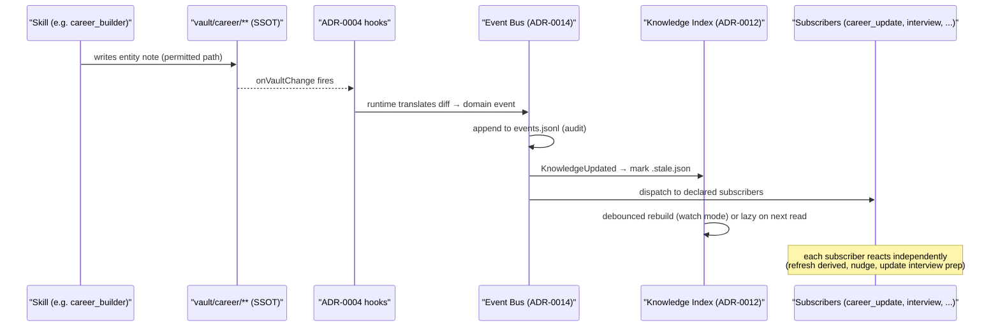

# ResumeOS Runtime

The core layer between the vault (SSOT) and the Skills (features). The runtime is responsible
for **indexing, event dispatch, caching, workflow orchestration, and shared memory**. It is
local-first, CLI-based, and works with zero MCP (ADR-0008) and zero cloud.

This is Phase 3. Phases 1–2 built the skeleton (ADRs 0000–0011, schemas, skills, UX specs).
Phase 3 builds the **runtime** that future Skills plug into, so that adding a LinkedIn
Importer, a Portfolio Generator, or a new Career Skill never requires modifying existing
architecture — only subscribing to events and reading the index.

## 1. What the runtime is (and is not)

**Is:** a set of local-first services that sit between `vault/career/**` (the SSOT graph) and
the Skills that read/write it. The runtime owns no career knowledge — it owns *access speed*,
*decoupling*, *orchestration*, and *shared state*.

**Is not:** a server, a daemon (in v1), or a cloud service. It is a CLI-invoked runtime:
`resume <command>` loads the runtime, runs Skills, persists events/index, exits. Watch mode
(ADR-0011 V2) is the long-running form.

## 2. Five subsystems

| Subsystem | ADRs | Purpose | Data home |
|-----------|------|---------|-----------|
| **Storage & Index** | ADR-0012, ADR-0013, ADR-0020 | Fast entity lookup, semantic search, shared conversation memory | `vault/.library/{index,embeddings,memory}/` |
| **Schema Extension** | ADR-0015, ADR-0016 | Entity version history + typed evidence relations | frontmatter `history[]`, `relations[]` (in `vault/career/**`) |
| **Orchestration** | ADR-0014, ADR-0018 | Domain event bus + declarative workflow engine | `vault/.library/events.jsonl`, `workflows/*.yaml` |
| **Plugin Family** | ADR-0019 | Importer family (`inbox_ingest` + sibling importers) | `skills/<source>_importer/` |
| **Registry** | ADR-0017 | Prompt registry (mirrors `skills/registry.yaml`) | `prompts/registry.yaml` |

Phase 3 produces the ADRs + schemas + specs for all five. Python implementation of the runtime
(event dispatcher, index builder, embedding worker) follows in Phase 3.5 or alongside Phase 4
Skill implementation — Phase 3 remains **spec-first**, consistent with Phases 1–2.

## 3. Runtime data root — `vault/.library/`

All runtime-managed data lives under `vault/.library/` (git-ignored, rebuildable). ADR-0011
established `.library/cache/`; ADR-0012 consolidates the rest here.

```
vault/.library/
├── cache/              # ADR-0011: transient OCR/hash/parse cache
├── index/              # ADR-0012: knowledge index (knowledge-index.json + .stale.json)
├── embeddings/         # ADR-0013: vector cache (<entity-id>.vec)
├── memory/             # ADR-0020: conversation memory (conversation.jsonl)
└── events.jsonl        # ADR-0014: event bus audit log
```

Everything under `.library/` is:
- **Git-ignored** — derived/rebuildable from `vault/career/**` + `logs/`.
- **Rebuildable** — delete any file; the next `resume index` / next event / next embedding run
  regenerates it. Never a data-loss event (the vault is the SSOT).
- **Never user-edited** — the runtime owns these files.

## 4. Data flow — vault change to Skill reaction



Key property: the writing Skill knows nothing about who reacts. `career_builder` writes a
project note and stops. The runtime handles fan-out. A new community Skill can subscribe to
`KnowledgeUpdated` without `career_builder` changing.

## 5. Relationship to Phase 1–2 artifacts

| Phase 1–2 artifact | Runtime relationship |
|--------------------|----------------------|
| `vault/career/**` (ADR-0001/0003) | SSOT — runtime reads it, indexes it, never replaces it |
| `schemas/*.schema.json` (ADR-0002) | ADR-0015/0016 extend entity schemas with `history[]` + `relations[]` |
| `skills/registry.yaml` (ADR-0004) | Unchanged; ADR-0017 adds `prompts/registry.yaml` as a parallel |
| `plugin.json` manifests (ADR-0005) | ADR-0014 adds `subscribes: [...]` key for event subscriptions |
| `resume_tailoring` checkpoint pipeline (ADR-0006) | ADR-0018 generalizes the pattern into declarative `workflows/*.yaml` |
| Anti-hallucination (ADR-0007) | Events + memory carry `entity_id`/`field` refs; memory stores only user-confirmed answers |
| MCP optional adapters (ADR-0008) | Embedding model (ADR-0013) is an MCP adapter; runtime works without it (degrades to keyword search) |
| `vault/.library/cache/` (ADR-0011) | One sibling under the consolidated `.library/` runtime root |
| `inbox_ingest` skill (ADR-0011) | ADR-0019 frames it as the inbox-specialized importer in a family |

## 6. Non-goals (v1)

- **Not a server.** No HTTP API, no daemon in v1. The runtime is CLI-invoked.
- **Not cross-process.** Event delivery is in-process for the current run; cross-run needs
  watch mode (ADR-0011 V2).
- **Not cloud.** All runtime data is local. Sync is a future concern, out of scope.
- **Not a replacement for the vault.** The index, embeddings, memory, and event log are all
  rebuildable projections. The vault is canonical (ADR-0001/0003).

## 7. Phase 3 execution order

1. **Keystone (this README + ADR-0012 + ADR-0014)** — everything depends on the index and
   event bus.
2. **Parallel batch 1:** ADR-0015 + ADR-0016 (schema extension), ADR-0017 (prompt registry),
   ADR-0019 (importer family), ADR-0013 + ADR-0020 (storage layer) — non-overlapping files.
3. **Batch 2:** ADR-0018 Workflow Engine (depends on the event bus conceptually).
4. **Closeout:** `docs/runtime/event-catalog.md`, `workflows/resume.yaml` example, schema
   files for index/event/workflow, `.gitignore` + `resumeos.config.yaml` updates, Oracle
   consistency review.

## 8. Documents in this track

| Document | Status |
|----------|--------|
| `docs/runtime/README.md` (this file) | keystone |
| `docs/decisions/ADR-0012-knowledge-index.md` | Accepted |
| `docs/decisions/ADR-0014-event-bus.md` | Accepted |
| `docs/decisions/ADR-0013-embedding-cache.md` | pending |
| `docs/decisions/ADR-0015-entity-versioning.md` | pending |
| `docs/decisions/ADR-0016-typed-evidence-relations.md` | pending |
| `docs/decisions/ADR-0017-prompt-registry.md` | pending |
| `docs/decisions/ADR-0018-workflow-engine.md` | pending |
| `docs/decisions/ADR-0019-importer-family.md` | pending |
| `docs/decisions/ADR-0020-ai-conversation-memory.md` | pending |
| `docs/runtime/event-catalog.md` | pending |
