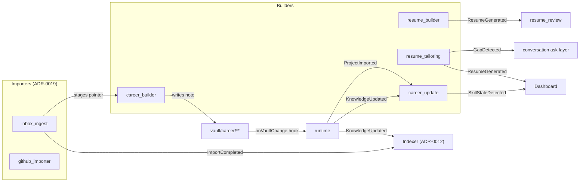

# Event Catalog

The authoritative list of domain events for the ResumeOS Event Bus (ADR-0014). Events are
**facts** (something happened), not **commands** (do this). Publishers emit; subscribers
react. Subscribers are declared in `plugin.json: subscribes: [...]`, not coded.

This catalog is **open**: community Skills may introduce new event types, namespaced
`plugin-name:EventName` per ADR-0004 §3. Built-in events use the bare names below.

Every event payload validates against `schemas/runtime/event.schema.json`:

```json
{
  "type": "string",
  "time": "ISO 8601 datetime",
  "source_skill": "string",
  "payload": { "per-type": "object" },
  "entity_refs": [{ "entity_type": "string", "entity_id": "string", "path": "string" }]
}
```

## Built-in events

### ProjectImported

A new project entity landed in `vault/career/projects/`, typically via an importer
(`inbox_ingest` or a sibling importer per ADR-0019).

| Field | Type | Description |
|------|------|-------------|
| `entity_id` | string | The project id (kebab-case, e.g. `px4-uav`) |
| `path` | string | Vault path to the project note |
| `source_import_id` | string \| null | The import-log run id, if from an importer |
| `source` | string | `inbox` \| `github` \| `notion` \| `drive` \| `manual` |

**Emitted by:** runtime (translating `onVaultChange` on a new `vault/career/projects/*.md`).
**Example subscribers:** `career_update` (refresh derived flags), indexer (ADR-0012), dashboard.

### KnowledgeUpdated

Any entity under `vault/career/**` changed — created, updated, or deleted. This is the
workhorse event; most subscribers listen to it.

| Field | Type | Description |
|------|------|-------------|
| `entity_id` | string | The entity id |
| `entity_type` | string | `project` \| `award` \| `research` \| `skill` \| … |
| `path` | string | Vault path to the entity note |
| `change_type` | string | `create` \| `update` \| `delete` |
| `fields` | [string] | Frontmatter fields that changed (empty on `create`/`delete`) |
| `version` | integer \| null | New entity version per ADR-0015 (null on delete) |

**Emitted by:** runtime (translating `onVaultChange` on any `vault/career/**/*.md`).
**Example subscribers:** `career_update` (derived views), `interview` (refresh prep),
indexer (ADR-0012 stale flag), embedding worker (ADR-0013 stale check).

### ResumeGenerated

A resume was written to `output/` by `resume_builder` or `resume_tailoring`.

| Field | Type | Description |
|------|------|-------------|
| `resume_id` | string | The generation job id |
| `target_role` | string \| null | The role/company the resume was tailored for |
| `target_company` | string \| null | Company name if known |
| `path` | string | Output path, e.g. `output/<job>/resume.md` |
| `generated_at` | string | ISO 8601 datetime |
| `generated_by` | string | `resume_builder` \| `resume_tailoring` |

**Emitted by:** `resume_builder`, `resume_tailoring` on writing `output/**`.
**Example subscribers:** `resume_review` (queue provenance audit), dashboard (recent output).

### SkillStaleDetected

A skill entity's `last_used` exceeds the staleness threshold. Drives the "skill getting rusty"
proactive nudge (`docs/ux/conversation-design.md` §4).

| Field | Type | Description |
|------|------|-------------|
| `skill_id` | string | The skill entity id |
| `skill_name` | string | Human-readable skill name |
| `last_used` | string | ISO 8601 date of last use |
| `threshold_days` | integer | Configured staleness threshold (default 730 = 2 years) |

**Emitted by:** `career_update` on detecting staleness during a `KnowledgeUpdated` reaction.
**Example subscribers:** conversation-design nudge layer, dashboard.

### ImportCompleted

An importer finished processing a source (a file in the inbox, a GitHub repo, a Notion page).
This is the success signal for the import lifecycle (`docs/ux/inbox-workflow.md`).

| Field | Type | Description |
|------|------|-------------|
| `sha256` | string \| null | Content hash (null for non-file sources like API imports) |
| `source` | string | `inbox` \| `github` \| `notion` \| `drive` \| `scholar` \| `linkedin` |
| `original_filename` | string \| null | Original filename if from a file |
| `detected_type` | string \| null | One of the 13 types from `docs/ux/data-lifecycle.md` §2.1 |
| `entity_id` | string \| null | The entity id created/updated (null if import produced none) |
| `status` | string | `success` \| `skipped` \| `replaced` \| `merged` \| `new_version` |
| `asset_location` | string \| null | Path to the stored original if any |

**Emitted by:** `inbox_ingest` and sibling importers (ADR-0019) on finishing a source.
**Example subscribers:** indexer (ADR-0012), dashboard, memory (ADR-0020 if a Q&A occurred).

### GapDetected

`resume_tailoring` phase 2 (gap analysis) found a missing field that would improve a tailored
resume. This drives the ask-never-invert conversation (`prompts/core/ask-never-invent.md`).

| Field | Type | Description |
|------|------|-------------|
| `entity_id` | string | The entity with the gap |
| `entity_type` | string | Entity type |
| `field` | string \| null | The missing frontmatter field (null if the gap is abstract) |
| `severity` | string | `high` \| `medium` \| `low` |
| `follow_up_question` | string | The question to ask the user (per conversation-design) |
| `tailoring_job_id` | string | The resume_tailoring job that found the gap |

**Emitted by:** `resume_tailoring` during gap analysis (ADR-0006 phase 2).
**Example subscribers:** conversation-design ask layer, dashboard (gap count).

## Workflow-emitted events

These domain events are emitted by the Workflow Engine (ADR-0018) when a workflow step with
`on_success_event` completes successfully. They are built-in events (not community events) and
follow the same `plugin.json: subscribes[]` subscription model. See `workflows/resume.yaml` for
the example workflow that emits them.

### ResearchCompleted

The `research` step of a tailoring workflow finished. The company/JD research artifact is ready
for gap analysis.

| Field | Type | Description |
|------|------|-------------|
| `workflow_id` | string | The workflow run id |
| `step_id` | string | `research` |
| `artifact_path` | string | Path to the research artifact JSON |
| `target_company` | string \| null | Company name if known |
| `target_role` | string \| null | Role if known |

**Emitted by:** workflow engine (ADR-0018) on `research` step success.
**Example subscribers:** dashboard, audit log.

### GapAnalysisCompleted

The `gap_analysis` step finished. The gaps artifact is ready; high-severity gaps drive the
ask-never-invent conversation.

| Field | Type | Description |
|------|------|-------------|
| `workflow_id` | string | The workflow run id |
| `step_id` | string | `gap_analysis` |
| `artifact_path` | string | Path to the gaps artifact JSON |
| `gap_count` | integer | Total gaps found |
| `high_severity_count` | integer | Gaps with severity `high` |

**Emitted by:** workflow engine on `gap_analysis` step success.
**Example subscribers:** conversation-design ask layer, dashboard (gap count).

### AssemblyCompleted

The `assembly` step finished. The assembly artifact (ranked bullets with provenance) is ready
for resume generation.

| Field | Type | Description |
|------|------|-------------|
| `workflow_id` | string | The workflow run id |
| `step_id` | string | `assembly` |
| `artifact_path` | string | Path to the assembly artifact JSON |
| `bullet_count` | integer | Number of assembled bullets |

**Emitted by:** workflow engine on `assembly` step success.
**Example subscribers:** dashboard.

### ReviewPassed

The `review` step finished and the resume passed the provenance audit (ADR-0007). No
untraceable bullets were found.

| Field | Type | Description |
|------|------|-------------|
| `workflow_id` | string | The workflow run id |
| `step_id` | string | `review` |
| `resume_path` | string | Path to the reviewed resume in `output/` |
| `issues_found` | integer | Total issues found (0 = clean) |
| `issues_blocking` | integer | Blocking issues (0 = passed) |

**Emitted by:** `resume_review` via workflow engine on `review` step success.
**Example subscribers:** dashboard, notifications.

### CoverLetterGenerated

The `cover_letter` step finished. A tailored cover letter was written to `output/`.

| Field | Type | Description |
|------|------|-------------|
| `workflow_id` | string | The workflow run id |
| `step_id` | string | `cover_letter` |
| `cover_letter_path` | string | Path to the cover letter in `output/` |
| `target_company` | string \| null | Company the letter is addressed to |

**Emitted by:** `cover_letter` via workflow engine on step success.
**Example subscribers:** dashboard.

### InterviewPrepGenerated

The `interview` step finished. Interview prep material was written to `output/`.

| Field | Type | Description |
|------|------|-------------|
| `workflow_id` | string | The workflow run id |
| `step_id` | string | `interview` |
| `interview_prep_path` | string | Path to the interview prep in `output/` |
| `target_role` | string \| null | Role the prep is targeted at |

**Emitted by:** `interview` via workflow engine on step success.
**Example subscribers:** dashboard.

## Community events

Community Skills introduce events namespaced as `plugin-name:EventName` (ADR-0004 §3). They
declare the event type in their own `plugin.json` and document the payload in their README.
The runtime routes them identically to built-in events. Examples (not implemented):

- `linkedin_importer:ProfileSynced` — a LinkedIn profile import finished.
- `portfolio_generator:PortfolioPublished` — a portfolio site was generated and deployed.
- `com_writer_research:PapersFound` — a community research Skill found new papers for an entity.

## Event flow reference



## Anti-hallucination (ADR-0007)

Every event carries `entity_refs[]` pointing at real vault entities. Events describe observed
state changes; they never carry fabricated content. A `GapDetected` event points at a real
missing field with a real question; it never invents a gap or suggests an invented answer.
A `KnowledgeUpdated` event's `fields[]` are the actual frontmatter keys that changed. Event
payloads are as auditable as vault frontmatter and are subject to the same anti-hallucination
contract.
