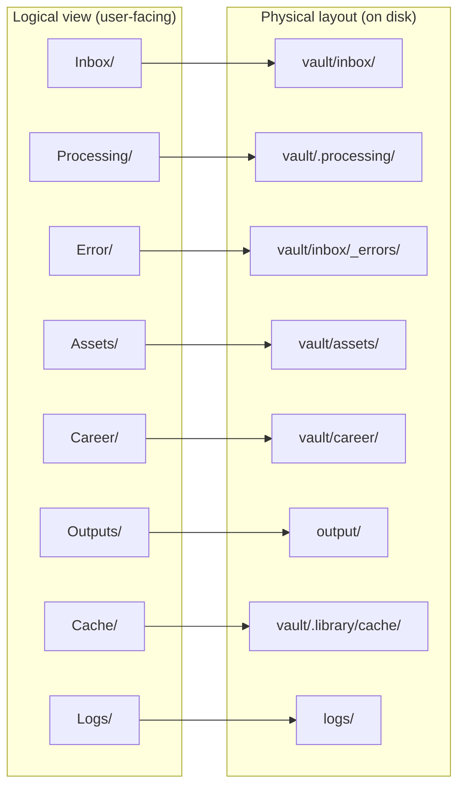
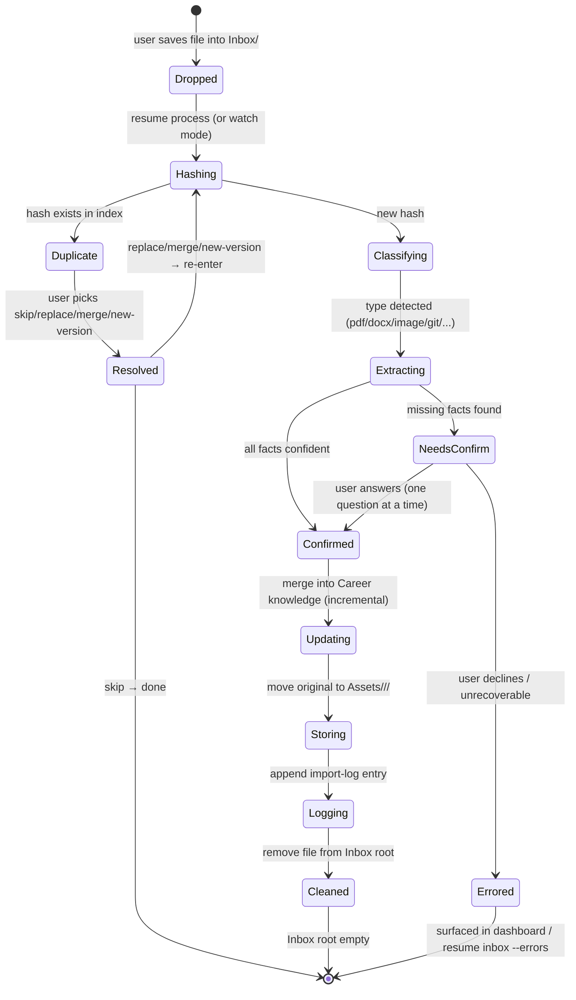
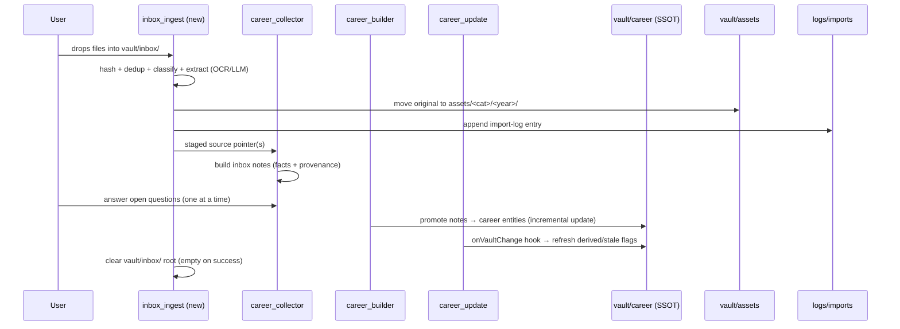

# ResumeOS — User Experience & Data Lifecycle Specification

> **Scope:** This track redesigns the **interaction model, data lifecycle, and user experience**
> of ResumeOS. It does **not** redesign the Phase 1 architecture (ADRs 0000–0010). Where the
> UX model introduces new directories or skills, they are placed as extensions consistent with
> the accepted ADRs — see [ADR-0011](../decisions/ADR-0011-inbox-asset-lifecycle-directories.md).

## Documents in this track

| Document | Contents |
|----------|----------|
| `README.md` (this file) | Core philosophy, directory model, file-lifecycle state machine, UX principles, document index |
| `inbox-workflow.md` | Inbox workflow, file-lifecycle detail, daily-workflow sequence diagrams, processing steps |
| `conversation-design.md` | Conversation principles, worked examples, career-assistant proactive behavior, user journey |
| `cli-specification.md` | Minimal CLI surface, command reference, watch-mode roadmap, developer notes |
| `data-lifecycle.md` | Import-log schema, duplicate-detection strategy, asset-management strategy, incremental update, knowledge-extraction classification |

---

## 1. Core philosophy

ResumeOS is an **intelligent career assistant**, not a resume editor. The division of labor is
absolute:

| The user does | ResumeOS does |
|---------------|---------------|
| Saves work (drops files into Inbox) | Classifies, extracts, organizes, links, stores |
| Answers targeted questions when asked | Asks one question at a time, only when needed |
| Says "tailor a resume for this job" | Researches, ranks, generates resume + letter + interview prep |
| Reviews generated outputs | Regenerates on request; never requires manual editing |

**Three invariants** flow from this:

1. **Knowledge Base is the Single Source of Truth.** `vault/career/**` is the only canonical
   career memory (ADR-0001). Everything else is derived or transient.
2. **The user never edits generated resumes directly.** `output/**` is derived, git-ignored,
   and regenerable (ADR-0001). To change a resume, change the vault and regenerate.
3. **The user continuously feeds; ResumeOS continuously organizes.** The user's only required
   gesture is "save my work into Inbox." Everything downstream is automated.

The target feeling: like **GitHub Desktop** + **Obsidian** + **Claude Code** — the user thinks
"I only save my work," and the system does the rest.

---

## 2. Directory model (logical → physical)

The user thinks in eight logical directories. They map to physical paths that respect the
Phase 1 architecture (vault = SSOT, output = derived). This mapping is canonical — see
[ADR-0011](../decisions/ADR-0011-inbox-asset-lifecycle-directories.md) for the rationale.

| Logical | Physical | Git | Obsidian | Purpose |
|---------|----------|-----|----------|---------|
| `Inbox/` | `vault/inbox/` | md committed; binaries ignored | yes | The one folder the user manages |
| `Processing/` | `vault/.processing/` | ignored | no (dotfolder) | Transient in-flight work |
| `Error/` | `vault/inbox/_errors/` | committed (stubs) | yes | Failed imports, visible for retry |
| `Assets/` | `vault/assets/<category>/<year>/` | ignored (binaries) | yes (attachments) | Permanent originals, never deleted |
| `Career/` | `vault/career/**` | committed | yes | SSOT knowledge graph |
| `Outputs/` | `output/` | ignored | no | Derived resumes/letters/packs |
| `Cache/` | `vault/.library/cache/` | ignored | no | OCR/parse/hash cache |
| `Logs/` | `logs/imports/` | committed | via Dataview note | Import audit trail |

**Categories under `Assets/`:** `awards/`, `projects/`, `research/`, `certificates/`,
`images/`, `videos/`, `documents/`. Each file is filed as
`vault/assets/<category>/<year>/<slug>-<short-hash>.<ext>`.

---

## 3. File-lifecycle state machine

Every imported file traverses this state machine. The happy path ends with an empty Inbox and
a permanent asset + knowledge update + log entry. Failures divert to `Error/` for retry.

**States that leave artifacts:**

- `Cleaned` — asset in `Assets/`, knowledge in `Career/`, entry in `Logs/`, Inbox root empty.
- `Errored` — error stub in `vault/inbox/_errors/`, no knowledge change, no asset move, Inbox
  root still empty (the failing file is relocated, not left in the root).

**Invariants:**

- A file never returns to `Inbox/` root after entering `Hashing`. It either ends in `Assets/`
  (success) or `_errors/` (failure).
- Originals are **moved**, never copied or deleted. `Assets/` is the immutable evidence store.
- `Processing/` is always empty between runs (a new run clears stale partial state first).

---

## 4. Skill ownership of the lifecycle

A new Tier-1 Skill `inbox_ingest` owns the file-level lifecycle (ADR-0011). It cooperates with
the existing Phase 1 skills without modifying them:

- **`inbox_ingest`** — file lifecycle: hash → dedup → classify → OCR/extract → move to Assets
  → log → emit staged pointers. Writes `vault/inbox/` (staged pointers), `vault/assets/`,
  `vault/.processing/`, `vault/.library/cache/`, `logs/`. Denies `vault/career/**`.
- **`career_collector`** (existing, unchanged scope) — staged pointers → inbox notes with
  extracted facts + `sources[]` provenance + `confidence: inferred`. Writes `vault/inbox/`.
  Denies `vault/career/**`.
- **`career_builder`** (existing) — inbox notes → `vault/career/**` structured entities.
- **`career_update`** (existing) — `onVaultChange` hook → incremental refresh + stale flags.

This split keeps each skill single-responsibility and replaceable (ADR-0004).

---

## 5. UX principles

1. **Inbox is the only required gesture.** Drag, drop, done. Everything else is optional.
2. **Never overwhelm.** Ask one question at a time. Only ask questions that improve the
   knowledge base. Never repeat an answered question.
3. **Never fabricate.** Anti-hallucination is absolute (ADR-0007). Missing facts → ask the
   user, never invent. Every bullet must cite `entity_id:field`.
4. **Never require editing generated output.** To change a resume, change the vault and
   regenerate. `output/` is derived and git-ignored.
5. **Be proactive, not interruptive.** Surface gaps (missing metrics, missing DOI, stale
   resume) politely via the dashboard, not by blocking work.
6. **Two-minute daily workflow.** Drop a README → ResumeOS processes, links, updates STAR
   story, files the asset, logs, empties Inbox. Under two minutes, no manual classification.
7. **Obsidian is home.** Users rarely leave the vault. Dataview, Canvas, backlinks, tags,
   properties, daily/periodic notes, QuickAdd, Templater are first-class.
8. **Incremental, never recreate.** Knowledge updates merge changed fields only, preserving
   previous values in version history. Never rebuild an entity from scratch on re-import.

---

## 6. Resume generation workflow (recap)

The user provides a job description **or** a company name. ResumeOS does the rest with minimal
interaction — this is the Phase 1 `resume_tailoring` checkpoint pipeline (ADR-0006), invoked
through the CLI:

```mermaid
flowchart LR
  U[User: JD or company name] --> R[resume tailor]
  R --> R1[Research company + JD]
  R1 --> R2[Gap analysis vs vault]
  R2 --> R3[Rank projects]
  R3 --> R4[Generate tailored resume]
  R4 --> R5[Generate cover letter]
  R5 --> R6[Generate interview prep]
  R6 --> O[output/&lt;job&gt;/]
```

Checkpoints (`research`, `gap_analysis`, `assembly`) surface for review only when the pipeline
needs a decision; otherwise it runs end-to-end. See `cli-specification.md` and the Phase 1
`resume_tailoring` SKILL.md.

---

## 7. Roadmap: Watch Mode

- **V1 (now):** manual — `resume process` ingests everything in `vault/inbox/`.
- **V2 (future):** watch mode — a daemon monitors `vault/inbox/` and auto-processes new files,
  moving completed ones out. Optional, off by default. See `cli-specification.md`.

---

## 8. Relationship to Phase 1 artifacts

| Phase 1 artifact | This track's relationship |
|------------------|---------------------------|
| ADRs 0000–0010 | Unchanged. ADR-0011 extends them. |
| `resumeos.config.yaml` | `inbox_ingest` added to `skills.enabled_default`; `vault.folders` gains `processing`, `errors`, `assets` entries (config change, not architecture change). |
| `skills/registry.yaml` | `inbox_ingest` appended (namespace `resumeos:inbox_ingest`). |
| `career_collector` SKILL.md | Scope unchanged; it now consumes `inbox_ingest` staged pointers in addition to direct user material. |
| `scripts/validate-vault.py` | Extended to validate `logs/imports.jsonl` entries and `vault/inbox/_errors/` stubs. |
| `docs/guides/obsidian-setup.md` | Updated to set Obsidian attachment folder to `vault/assets/`. |
