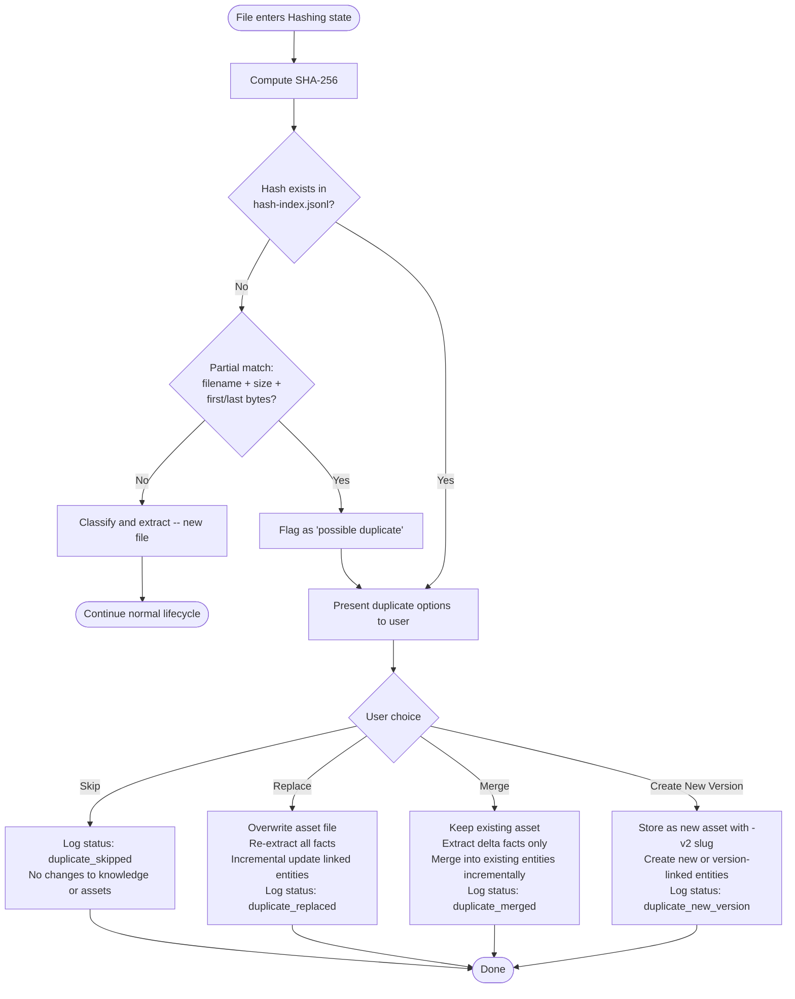
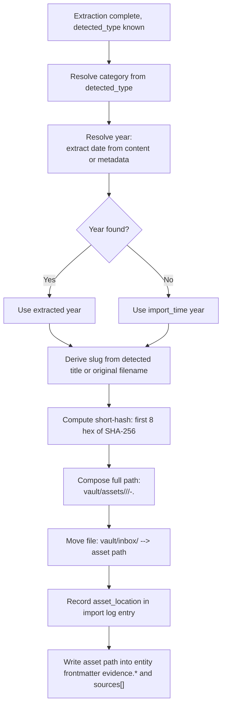

# Data Lifecycle Internals

> Implements the internal data structures and strategies specified by the
> [keystone README](./README.md) and [ADR-0011](../decisions/ADR-0011-inbox-asset-lifecycle-directories.md).
> This document does not repeat the user-facing lifecycle; it defines what happens behind the scenes.

---

## 1. Overview

This document specifies the internal data structures and strategies that make the Inbox-first
lifecycle work -- import logs, duplicate detection, asset management, incremental update, and
knowledge-extraction classification. Each section names the physical paths, the schema contracts,
and the invariants that `inbox_ingest` and downstream skills must uphold. Cross-references to
[ADR-0001](../decisions/ADR-0001-knowledge-base-as-single-source-of-truth.md),
[ADR-0007](../decisions/ADR-0007-anti-hallucination-contract.md), and
[ADR-0011](../decisions/ADR-0011-inbox-asset-lifecycle-directories.md) are canonical; where
this document and those ADRs overlap, the ADRs govern.

---

## 2. Import log schema

Every file that enters `vault/inbox/` produces exactly one log entry when `resume process`
(or watch mode) handles it. The entry records what was imported, what knowledge it created or
updated, what questions were asked, and what the outcome was.

### 2.1 JSON Schema (draft 2020-12)

```json
{
  "$schema": "https://json-schema.org/draft/2020-12/schema",
  "$id": "https://resumeos.dev/schemas/import-log-entry.schema.json",
  "title": "Import Log Entry",
  "description": "One import-log entry per inbox file. Appended to logs/imports.jsonl on each ingestion run.",
  "type": "object",
  "additionalProperties": false,
  "required": [
    "import_time",
    "original_filename",
    "sha256",
    "detected_type",
    "user_confirmation",
    "status"
  ],

  "properties": {
    "import_time": {
      "type": "string",
      "format": "date-time",
      "description": "ISO 8601 datetime of the import run that processed this file."
    },
    "original_filename": {
      "type": "string",
      "minLength": 1,
      "description": "Filename as the user dropped it into vault/inbox/."
    },
    "sha256": {
      "type": "string",
      "pattern": "^[a-f0-9]{64}$",
      "description": "SHA-256 hex digest of the original file bytes (64 lowercase hex characters)."
    },
    "detected_type": {
      "type": "string",
      "enum": [
        "certificate",
        "competition",
        "project",
        "research_paper",
        "resume",
        "transcript",
        "git_repository",
        "readme",
        "presentation",
        "technical_documentation",
        "blog",
        "image",
        "video"
      ],
      "description": "Classification result from knowledge-extraction (Section 6)."
    },
    "knowledge_created": {
      "type": "array",
      "description": "New knowledge entities created by this import.",
      "items": { "$ref": "#/$defs/entity_ref" },
      "default": []
    },
    "knowledge_updated": {
      "type": "array",
      "description": "Existing knowledge entities updated by this import.",
      "items": { "$ref": "#/$defs/entity_ref_updated" },
      "default": []
    },
    "asset_location": {
      "type": ["string", "null"],
      "description": "Relative path to the moved original in vault/assets/, or null if no physical asset was filed (e.g. git_repository with no local binary)."
    },
    "questions_asked": {
      "type": "array",
      "description": "Questions posed to the user during extraction, per the anti-hallucination contract (ADR-0007).",
      "items": { "$ref": "#/$defs/question_entry" },
      "default": []
    },
    "user_confirmation": {
      "type": "boolean",
      "description": "True if the user confirmed the extracted facts before the knowledge base was updated."
    },
    "status": {
      "type": "string",
      "enum": [
        "success",
        "partial",
        "error",
        "duplicate_skipped",
        "duplicate_merged",
        "duplicate_replaced",
        "duplicate_new_version"
      ],
      "description": "Outcome of the import. See Section 3 for duplicate statuses."
    }
  },

  "$defs": {
    "entity_ref": {
      "type": "object",
      "description": "Reference to a newly created knowledge entity.",
      "additionalProperties": false,
      "required": ["entity_type", "entity_id", "path"],
      "properties": {
        "entity_type": {
          "type": "string",
          "description": "Entity discriminator matching the target schema (e.g. 'award', 'project', 'research', 'education', 'internship', 'competition', 'opensource')."
        },
        "entity_id": {
          "type": "string",
          "pattern": "^[a-z0-9-]+$",
          "description": "Stable slug id of the entity, matching the id field in the entity frontmatter."
        },
        "path": {
          "type": "string",
          "description": "Relative path to the entity note, e.g. 'vault/career/awards/robomaster-2025-gold.md'."
        }
      }
    },
    "entity_ref_updated": {
      "type": "object",
      "description": "Reference to an existing knowledge entity that was updated by this import.",
      "additionalProperties": false,
      "required": ["entity_type", "entity_id", "path", "fields_changed"],
      "properties": {
        "entity_type": {
          "type": "string",
          "description": "Entity discriminator, same vocabulary as entity_ref."
        },
        "entity_id": {
          "type": "string",
          "pattern": "^[a-z0-9-]+$",
          "description": "Stable slug id of the entity."
        },
        "path": {
          "type": "string",
          "description": "Relative path to the entity note."
        },
        "fields_changed": {
          "type": "array",
          "description": "Frontmatter field names that were modified by the merge (Section 5).",
          "items": { "type": "string" }
        }
      }
    },
    "question_entry": {
      "type": "object",
      "description": "One question posed to the user during extraction (ADR-0007).",
      "additionalProperties": false,
      "required": ["question", "answer", "entity_id", "field"],
      "properties": {
        "question": {
          "type": "string",
          "description": "The question text as posed to the user."
        },
        "answer": {
          "type": ["string", "null"],
          "description": "The user's response, or null if the user declined or the question was unanswered."
        },
        "entity_id": {
          "type": "string",
          "description": "The entity_id this answer populates."
        },
        "field": {
          "type": "string",
          "description": "The frontmatter field this answer fills, e.g. 'role', 'doi', 'metrics'."
        }
      }
    }
  }
}
```

### 2.2 Worked example

User drops `RoboMaster_2025_Gold_Award.pdf` into `vault/inbox/`. Extraction produces a new
award entity and updates the existing competition entity with a certificate image reference.

```json
{
  "import_time": "2026-06-29T09:14:00+08:00",
  "original_filename": "RoboMaster_2025_Gold_Award.pdf",
  "sha256": "a1b2c3d4e5f6a1b2c3d4e5f6a1b2c3d4e5f6a1b2c3d4e5f6a1b2c3d4e5f6a1b2",
  "detected_type": "certificate",
  "knowledge_created": [
    {
      "entity_type": "award",
      "entity_id": "robomaster-2025-gold",
      "path": "vault/career/awards/robomaster-2025-gold.md"
    }
  ],
  "knowledge_updated": [
    {
      "entity_type": "competition",
      "entity_id": "robomaster-2025",
      "path": "vault/career/competitions/robomaster-2025.md",
      "fields_changed": ["evidence.image"]
    }
  ],
  "asset_location": "vault/assets/certificates/2025/robomaster-2025-gold-award-a1b2c3d4.pdf",
  "questions_asked": [
    {
      "question": "What was your role in the RoboMaster 2025 competition?",
      "answer": "Algorithm Lead",
      "entity_id": "robomaster-2025",
      "field": "role"
    }
  ],
  "user_confirmation": true,
  "status": "success"
}
```

### 2.3 Storage

| Layer | Path | Format | Git |
|-------|------|--------|-----|
| Per-run log | `logs/imports/<YYYY-MM-DD>/<run-id>.jsonl` | One JSON line per file in the run | committed |
| Rolled index | `logs/imports.jsonl` | Append-only rolling file; all entries, newest last | committed |
| Dashboard | `vault/career/_import-log.md` | Obsidian note rendering recent entries via Dataview | committed |

**Rules:**

1. Each `resume process` invocation creates one `<run-id>.jsonl` under today's date folder and
   appends its entries to `logs/imports.jsonl`.
2. `<run-id>` is a short timestamp slug: `run-<HHMMSS>`.
3. Logs are committed because they are historical audit data, not regenerable
   ([ADR-0011](../decisions/ADR-0011-inbox-asset-lifecycle-directories.md) Rule 8).
4. The Dataview dashboard note queries `logs/imports.jsonl` and renders the last 50 entries
   in a sortable table, so the user audits without leaving Obsidian.

---

## 3. Duplicate detection strategy

### 3.1 Hash index

`inbox_ingest` maintains a content-addressed hash index:

```
vault/.library/cache/hash-index.jsonl
```

**Format:** JSON Lines — one record per line, append-only. Each line is a JSON object keyed by `sha256`. This matches `logs/imports.jsonl` semantics and lets `inbox_ingest` append without rewriting the whole index.

```jsonl
{"sha256":"a1b2c3d4...","first_import_time":"2026-06-29T09:14:00+08:00","asset_location":"vault/assets/certificates/2025/robomaster-2025-gold-award-a1b2c3d4.pdf","entity_refs":[{"entity_type":"award","entity_id":"robomaster-2025-gold","path":"vault/career/awards/robomaster-2025-gold.md"}]}
{"sha256":"e5f6a7b8...","first_import_time":"2026-06-29T10:02:00+08:00","asset_location":"vault/assets/projects/2024/px4-uav-readme-e5f6a7b8.md","entity_refs":[{"entity_type":"project","entity_id":"px4-uav","path":"vault/career/projects/px4-uav.md"}]}
```

**Properties:**

- Git-ignored (`vault/.library/` is in `.gitignore`). Regenerable from `logs/imports.jsonl` plus
  the files in `vault/assets/`.
- Indexed by SHA-256 for O(1) lookup per inbox file.
- `entity_refs[]` lists every knowledge entity linked to this hash at first import time, so
  Replace / Merge / New Version can navigate to the affected entities without scanning
  `vault/career/`.

### 3.2 Detection flow



**Branch invariants:**

- **Skip** -- no knowledge changes, no asset changes. The Inbox file is moved to
  `vault/inbox/_errors/` with a note "duplicate -- skipped" or simply removed from the Inbox
  root with no further action. The import log status is `duplicate_skipped`.
- **Replace** -- the existing asset at `asset_location` is overwritten with the new file. All
  linked entities are re-extracted from the new file, and updates are applied incrementally
  (Section 5). Prior values are snapshotted to `vault/.library/versions/` before overwrite.
  Status: `duplicate_replaced`.
- **Merge** -- the old asset is kept. The new file is parsed only for *delta* facts that differ
  from or supplement the existing extraction. Merged into existing entities using the rules in
  Section 5. Status: `duplicate_merged`.
- **Create New Version** -- the new file is stored as a separate asset with a `-v2` (or
  incrementing) slug suffix. New knowledge entities are created, or the existing entity is
  versioned (a new entity note referencing the original via `related[]`). Status:
  `duplicate_new_version`.

### 3.3 Duplicate invariant

**Never create a duplicate knowledge entity.** If a file maps to an `entity_id` that already
exists, the system merges fields into the existing entity rather than creating a second note
with the same semantic identity. The `entity_id` is reused; fields are merged
(Section 5). This invariant is enforced by `inbox_ingest` before `career_builder` runs.

### 3.4 Partial-match fallback

When the SHA-256 does not match any hash-index entry, `inbox_ingest` performs a secondary
check:

1. Match on `original_filename` (case-insensitive, extension-stripped).
2. Match on file size (exact byte count).
3. Match on first 1024 + last 1024 bytes.

If all three match, the file is flagged `"possible duplicate"` and the same four options
(Skip / Replace / Merge / Create New Version) are presented, with a UI note explaining the
match is heuristic. If the user confirms any option, it proceeds as a duplicate. If the user
declines, the file continues the normal lifecycle as a new import.

---

## 4. Asset management strategy

### 4.1 Path scheme

Every original file filed from the Inbox lands at:

```
vault/assets/<category>/<year>/<slug>-<short-hash>.<ext>
```

| Segment | Source | Example |
|---------|--------|---------|
| `<category>` | Resolved from `detected_type` via the mapping below | `certificates` |
| `<year>` | Year extracted from the file's metadata or content; falls back to import year | `2025` |
| `<slug>` | Kebab-case from detected title or original filename, truncated to 80 chars | `robomaster-2025-gold-award` |
| `<short-hash>` | First 8 hex characters of SHA-256 | `a1b2c3d4` |
| `<ext>` | Original file extension, lowercased | `pdf` |

**Category mapping** (detected_type to asset category):

| detected_type | category |
|---------------|----------|
| `certificate` | `certificates` |
| `competition` | `awards` |
| `project` | `projects` |
| `research_paper` | `research` |
| `resume` | `documents` |
| `transcript` | `documents` |
| `presentation` | `documents` |
| `technical_documentation` | `documents` |
| `blog` | `documents` |
| `image` | `images` |
| `video` | `videos` |
| `git_repository` | `projects` |
| `readme` | `projects` |

### 4.2 Filing flow



### 4.3 Move semantics

- Originals are **moved**, not copied. `vault/inbox/` loses the file; `vault/assets/` gains it.
- Originals are **never deleted**. `vault/assets/` is the immutable evidence store
  ([ADR-0011](../decisions/ADR-0011-inbox-asset-lifecycle-directories.md) Rule 9).
- Assets are git-ignored (binary files). The vault stays lean; the committed markdown references
  them by path.

### 4.4 Provenance

Every asset path is recorded in two places:

1. The import log entry's `asset_location` field.
2. The linked entity's frontmatter: `evidence.*` (per the entity schema -- `evidence.image`,
   `evidence.github`, `evidence.paper`, `evidence.patent`, `evidence.presentation`,
   `evidence.images`, `evidence.demo`, `evidence.url`) and `sources[]` (with
   `kind: "<detected_type>"`, `ref: "<asset_path>"`).

This double-record satisfies ADR-0001 Rule 5 (provenance) and ADR-0007 Rule 3 (every bullet
citable).

### 4.5 Reorganization

Assets are **immutable once filed**. The path is the identity -- references in entity
frontmatter and the import log depend on it. Renaming or moving an asset after filing breaks
those references. If a correction is needed (e.g. wrong year), the file is stored at the new
path and the old path becomes a stale reference; the import log remains as audit history but
new imports do not reuse the old path. In practice, reorganization is rare because the filing
rules are deterministic.

---

## 5. Incremental knowledge update strategy

### 5.1 Principle

Per [ADR-0001](../decisions/ADR-0001-knowledge-base-as-single-source-of-truth.md) and the
keystone README (Section 5, Rule 8): **never recreate an entity on re-import**. When a file
targets an entity that already exists, the system merges changed fields only, preserving prior
values in version history.

### 5.2 Merge rules

| Field class | Examples | Merge behavior |
|-------------|----------|----------------|
| Scalar facts | `date`, `role`, `company`, `venue`, `doi`, `gpa` | Replace if new value has higher confidence (`confirmed` > `inferred` > `missing`). Keep prior in version history (Section 5.3). |
| Array facts | `stack.*[]`, `tags[]`, `ats_keywords[]`, `authors[]`, `coursework[]`, `honors[]` | Union of old + new, deduplicated. Order preserved (existing first, new appended). |
| Narrative fields | `star_story`, `summary`, `contribution`, `abstract`, `description` | Regenerate from updated facts; keep prior version in version history. |
| Evidence / sources | `evidence.*`, `sources[]` | Append new entries; never remove existing. Deduplicate on `ref`. |
| Metrics | `metrics[]` | Replace entries matching on `metric` name; append entries with new `metric` names. |
| Confidence | `confidence` | Take the highest: `confirmed` > `inferred` > `missing`. |
| Timeline | `timeline.start`, `timeline.end`, `timeline.ongoing` | `start`: replace only if new is confirmed. `end` / `ongoing`: replace with newer data. |

**Conflict resolution:** if the new value is `inferred` and the existing value is `confirmed`,
keep the existing value and do **not** ask the user (the vault value wins). If the new value
is `confirmed` and the existing is `confirmed` but they differ (e.g. two different dates),
this is a **conflict** -- pose the question to the user (ADR-0007).

### 5.3 Version history

Before any field is overwritten on an existing entity, the entire current frontmatter is
snapshotted:

```
vault/.library/versions/<entity_id>/<timestamp>.json
```

- `<entity_id>` matches the entity's `id` field.
- `<timestamp>` is ISO 8601 with seconds precision: `2026-06-29T09-14-00.json`.
- The snapshot is a JSON object containing the full frontmatter as it existed before the merge.

**Properties:**

- Git-ignored (regenerable from git history of the vault note, but kept for fast diffing
  without `git log -p`).
- Enables diff display in the dashboard: "role changed from 'Engineer' to 'Lead Engineer' on
  2026-06-29."

### 5.4 Field change tracking

The import log's `knowledge_updated[].fields_changed` array records every frontmatter field
modified by the merge. This is the canonical audit of what changed in this import, independent
of the version snapshot.

### 5.5 Entity update lifecycle

```mermaid
stateDiagram-v2
  [*] --> Unchanged: entity exists in vault/career
  Unchanged --> CandidateUpdate: re-import file targets this entity_id
  CandidateUpdate --> DiffDetected: compare extracted facts vs current frontmatter

  DiffDetected --> Merge: values compatible, auto-merge per rules (Section 5.2)
  DiffDetected --> Conflict: values contradict at same confidence level; must ask user

  Merge --> Merged: apply field-level merge (replace / union / append)
  Conflict --> Merged: user resolves via question; chosen value applied

  Merged --> VersionSnapshotWritten: write prior frontmatter to vault/.library/versions/
  VersionSnapshotWritten --> Confirmed: log fields_changed in import log; update hash-index

  Confirmed --> Unchanged: entity is stable, await next import
```

---

## 6. Knowledge-extraction classification

The table below maps each detected input type to its detection signals, extraction method,
likely entity type(s), key fields extracted, and the fields that trigger a user question if
missing (anti-hallucination, ADR-0007). Detection is performed by `inbox_ingest` during the
Classifying state.

| Input type | Detection signals | Extraction method | Likely entity type | Key fields extracted | Fields that trigger question if missing |
|------------|-------------------|-------------------|--------------------|----------------------|----------------------------------------|
| **Certificate** | `.pdf`, `.png`, `.jpg` containing "certificate", "certified", "credential"; structured issuer/date layout | OCR + LLM | `award` + linked `competition` | `issuer`, `date`, `title`, `credential_id`, `level` | `issuer`, `date`, `credential_id` |
| **Competition** | `.pdf`, `.docx` with award/ranking/competition keywords; mentions of placement | OCR + LLM | `competition` + `award` | `name`, `host`, `year`, `level`, `result`, `role`, `team_size`, `project_ref` | `host`, `year`, `result`, `role` |
| **Project** | `.git/` directory, `package.json`, `Cargo.toml`, repo URL, or README of a codebase | MCP github + LLM | `project` | `title`, `role`, `stack`, `metrics`, `timeline`, `github_url`, `contribution` | `role`, `metrics`, `timeline.end`, `team_size` |
| **Research Paper** | `.pdf` with abstract, DOI, arXiv header, venue, author list | Text parse + LLM | `research` | `title`, `venue`, `year`, `doi`, `authors`, `author_role`, `abstract`, `my_contribution` | `doi`, `venue`, `my_contribution` |
| **Resume** | `.pdf`, `.docx` with structured sections (experience, education, skills, summary); keyword density | Text parse + OCR + LLM | Multiple: `internship`, `project`, `education`, `skill` | Per section: `company`, `role`, `timeline`, `stack`, `degree`, skills list | `metrics` per role, specific `timeline` dates |
| **Transcript** | `.pdf` with course/grade/GPA structure; university letterhead or registrar mark | OCR + LLM | `education` | `institution`, `degree`, `field`, `gpa`, `coursework`, `timeline`, `honors` | `gpa`, `field`, `ranking` |
| **Git Repository** | `.git/` directory in inbox; or bare repo bundle | MCP github | `project` or `opensource` | `repo_url`, `languages`, `stars`, `merged_prs`, `contributions`, `timeline`, `description` | `role`, per-contribution `description`, `contribution` summary |
| **README** | `README.md` or `readme.md`; contains project title, stack, links, badges | Text parse + LLM | `project` | `title`, `stack`, `description`, `github_url` | `role`, `metrics`, `timeline`, `team_size` |
| **Presentation** | `.pptx`, `.key`, `.pdf` with slide structure; conference/deck keywords: "slides", "deck", "keynote" | Metadata + OCR + LLM | `project` or `research` | `title`, `event`, `date`, `key_points`, `audience` | `event`, `date`, `related_entity` |
| **Technical Documentation** | `.pdf`, `.md` with technical headings (API, spec, architecture); no abstract/venue pattern | Text parse + LLM | `project` or skill note | `title`, `technologies`, `key_concepts`, `related_project` | `related_project`, `date`, `author_role` |
| **Blog** | `.md`, `.html` with date/title/tags metadata; URL patterns (`/blog/`, `/posts/`); prose style | Text parse + LLM | `project` or `research` | `title`, `url`, `date`, `topics`, `audience` | `audience`, `related_project`, impact metrics |
| **Image** | `.png`, `.jpg`, `.webp`, `.gif`; screenshot/dashboard/certificate visual patterns; no text-dominant layout | OCR + metadata | Evidence for existing entity (context-dependent) | `description`, `date`, `source_entity` | `source_entity` (which entity does this belong to?), `date`, `description` |
| **Video** | `.mp4`, `.mov`, `.webm`, `.avi`; media container metadata (duration, resolution) | Metadata only | Evidence for existing entity (context-dependent) | `title`, `duration`, `date`, `related_project` | `related_project`, `description`, `date` |

**Extraction method abbreviations:**

- **Text parse** -- direct file reading (UTF-8 text, structured formats like YAML/JSON frontmatter).
- **OCR** -- Optical Character Recognition on raster pages (Tesseract or equivalent).
- **LLM** -- Language model extraction with structured output schema; obeys ADR-0007.
- **MCP github** -- GitHub MCP tool call: fetch repository metadata, commits, PRs, languages.
- **Metadata** -- File-level metadata (EXIF, container atoms, embedded properties) only.

**Confidence tagging:** every field extracted is tagged `confirmed` (explicit text), `inferred`
(model deduction with high signal), or `missing` (field not found). Only `confirmed` values
enter derived documents. `inferred` and `missing` values trigger follow-up questions per the
"Fields that trigger question if missing" column.

---

## 7. Cross-references

| Document | Relevance |
|----------|-----------|
| [inbox-workflow.md](./inbox-workflow.md) | Where these internals sit in the visible user workflow; file-lifecycle state machine detail |
| [conversation-design.md](./conversation-design.md) | How `questions_asked` are posed to the user; one-question-at-a-time interaction |
| [cli-specification.md](./cli-specification.md) | `resume process` (triggers ingestion) and `resume dashboard` (renders import log) |
| [ADR-0001](../decisions/ADR-0001-knowledge-base-as-single-source-of-truth.md) | Vault as SSOT; provenance rule; one-way flow |
| [ADR-0007](../decisions/ADR-0007-anti-hallucination-contract.md) | Anti-hallucination contract; `questions_asked` rationale; confidence tagging |
| [ADR-0011](../decisions/ADR-0011-inbox-asset-lifecycle-directories.md) | Physical directory placement; `inbox_ingest` skill ownership; rules 1-10 |
