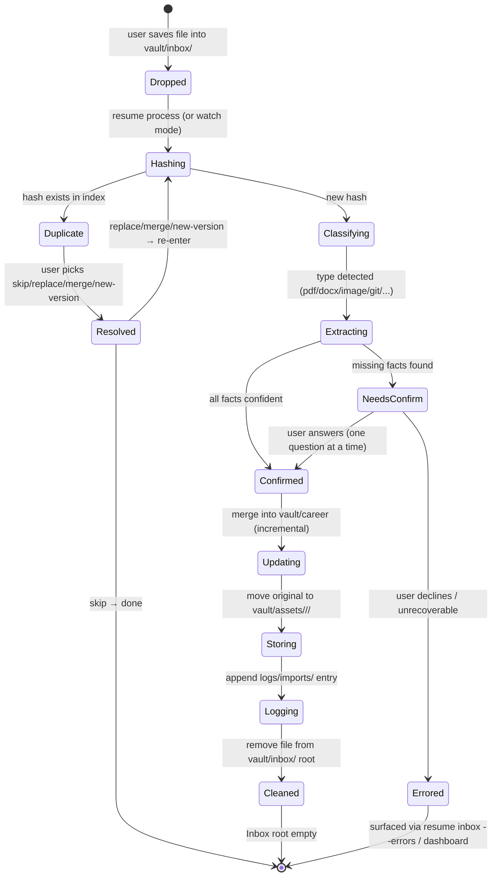
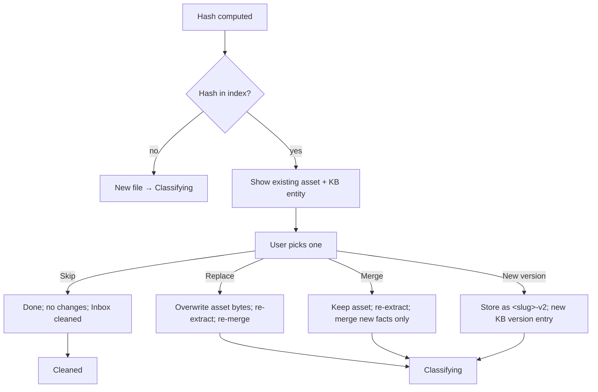
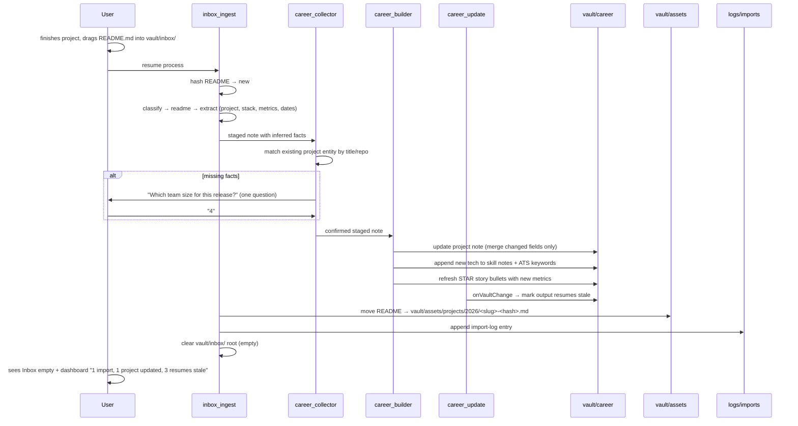

# Inbox Workflow

> **Scope:** The end-to-end file lifecycle of a single import, from drop to cleaned Inbox.
> This document expands the state machine and skill-ownership sequence in
> [`README.md`](README.md) with per-state detail, the processing pipeline, duplicate handling,
> a worked daily-workflow sequence, and failure/recovery. Directory placement follows
> [ADR-0011](../decisions/ADR-0011-inbox-asset-lifecycle-directories.md). Import-log fields and
> the hash index live in [`data-lifecycle.md`](data-lifecycle.md). Conversation behavior during
> `NeedsConfirm` lives in [`conversation-design.md`](conversation-design.md). The CLI surface
> that drives this workflow lives in [`cli-specification.md`](cli-specification.md).

## 1. Lifecycle at a glance

A file enters `vault/inbox/` and cannot return there after processing begins. It ends in exactly
one of two terminal states:

- **`Cleaned`** — original moved to `vault/assets/<category>/<year>/`, knowledge merged into
  `vault/career/**`, an entry appended to `logs/imports/`, and the Inbox root left empty.
- **`Errored`** — file moved to `vault/inbox/_errors/` with an error-stub note; no knowledge
  change, no asset move, Inbox root still empty (the failing file is relocated, not left behind).

The state machine below is the canonical reference; the rest of this document expands each state
and transition.

**Invariants:**

- A file never returns to the `vault/inbox/` root after entering `Hashing`.
- Originals are **moved**, never copied or deleted. `vault/assets/` is the immutable evidence store.
- `vault/.processing/` is always empty between runs; a new run clears stale partial state first.
- A successful run leaves the Inbox root empty. Only `vault/inbox/_errors/` may retain stubs.

## 2. State reference

| State | Entry condition | Exit condition | Artifacts written | Owner |
|-------|-----------------|----------------|-------------------|-------|
| `Dropped` | File appears in `vault/inbox/` root | `resume process` or watch mode picks it up | none | user |
| `Hashing` | Run starts; file moved to `vault/.processing/` | SHA256 computed and checked against index | `vault/.library/cache/hash-index.jsonl` (append) | `inbox_ingest` |
| `Duplicate` | Hash already in index | User resolves (skip / replace / merge / new version) | resolution recorded in import-log | `inbox_ingest` |
| `Classifying` | New hash confirmed | Detected type selected (see §4 table) | `vault/.processing/<slug>.type.json` | `inbox_ingest` |
| `Extracting` | Type known | Facts + provenance extracted (OCR/LLM/metadata) | `vault/.processing/<slug>.extract.json` | `inbox_ingest` |
| `NeedsConfirm` | Extracted facts have gaps that affect KB quality | All open questions answered or user declines | questions list in `vault/inbox/<slug>.staged.md` | `career_collector` |
| `Confirmed` | Facts complete (or were already complete) | Merge plan ready | staged note finalized | `career_collector` |
| `Updating` | Staged note ready | Entity created/updated in `vault/career/**` (incremental merge) | `vault/career/<entity>.md` (+ version history) | `career_builder`, `career_update` |
| `Storing` | Knowledge merged | Original moved to `vault/assets/<category>/<year>/` | asset file at canonical path | `inbox_ingest` |
| `Logging` | Asset stored | Import-log entry appended | `logs/imports/<run>.jsonl` + `logs/imports.jsonl` | `inbox_ingest` |
| `Cleaned` | Log written | File removed from `vault/inbox/` root | (none — removal) | `inbox_ingest` |
| `Errored` | Unrecoverable failure or user decline | File in `vault/inbox/_errors/<slug>.<ext>` + stub note | `vault/inbox/_errors/<slug>.md` | `inbox_ingest` |

## 3. Processing pipeline (per file)

`inbox_ingest` runs these steps for each file. Order is strict; a step that fails diverts to
`Errored` and the next file is processed.

1. **Acquire.** Pick the next file from `vault/inbox/` root (excluding `_errors/`). Move it into
   `vault/.processing/<run-id>/<slug>.<ext>` so the Inbox root already reflects "in flight."
2. **Hash.** Compute `SHA256` of the file bytes. Append `{sha256, filename, size, first_seen_at}`
   to `vault/.library/cache/hash-index.jsonl` only if the hash is new. If the hash exists, go to
   `Duplicate` (see §5).
3. **Classify.** Detect type from extension, MIME, and content sniff (PDF text layer, DOCX XML,
   image EXIF, git directory presence, README heading). Emit
   `vault/.processing/<run-id>/<slug>.type.json` with `{type, confidence, signals[]}`. The type
   set is closed (see §4).
4. **Extract.** Pull facts and provenance using the type-appropriate extractor (PDF text, DOCX
   XML, OCR for images/scans, README parser, git log/README for repos). Emit
   `vault/.processing/<run-id>/<slug>.extract.json` with structured facts and a `sources[]`
   provenance list (each source points at the asset path + byte range or page).
5. **Stage.** Write a staged note `vault/inbox/<slug>.staged.md` summarizing extracted facts with
   `confidence: confirmed|inferred|missing` per field (ADR-0007). Hand off to `career_collector`.
6. **Confirm.** If any field is `missing` and the field would improve the KB, ask the user — one
   question at a time, per [`conversation-design.md`](conversation-design.md). Never ask about
   fields that are already `confirmed` or that do not affect KB quality.
7. **Update.** `career_builder` merges the staged note into `vault/career/**` incrementally:
   only changed fields are written, previous values preserved in version history (see
   [`data-lifecycle.md`](data-lifecycle.md) §Incremental update). `career_update` fires on the
   `onVaultChange` hook to refresh stale flags and derived views.
8. **Store.** Move the original from `vault/.processing/<run-id>/` to
   `vault/assets/<category>/<year>/<slug>-<short-hash>.<ext>`. The short hash is the first 12 hex
   chars of the SHA256; it disambiguates same-slug originals across years.
9. **Log.** Append an import-log entry to `logs/imports/<run-id>.jsonl` and the rolled index
   `logs/imports.jsonl`. Fields per [`data-lifecycle.md`](data-lifecycle.md) §Import log schema.
10. **Clean.** Delete the staged note from `vault/inbox/` and any partial state from
    `vault/.processing/<run-id>/`. The Inbox root is now empty for this file.

## 4. Knowledge-extraction classification

| Detected type | Signals | Extractor | Asset category |
|---------------|---------|-----------|----------------|
| `certificate` | PDF/scan, issuer name, issue date, cert ID | OCR + LLM | `vault/assets/certificates/<year>/` |
| `competition` | award rank, team size, event name, date | OCR + LLM | `vault/assets/awards/<year>/` |
| `project` | README structure, repo dir, architecture section | README parser / git | `vault/assets/projects/<year>/` |
| `research_paper` | DOI, arXiv ID, abstract, author list | PDF text + metadata | `vault/assets/research/<year>/` |
| `resume` | resume sections, contact header | DOCX/PDF parser | `vault/assets/documents/<year>/` |
| `transcript` | course list, grades, GPA, institution | PDF/DOCX parser | `vault/assets/documents/<year>/` |
| `git_repository` | `.git/` present, README, commit log | git log + README | `vault/assets/projects/<year>/` |
| `readme` | README heading, no repo | README parser | `vault/assets/projects/<year>/` |
| `presentation` | PPTX/PDF slide deck | slide text extractor | `vault/assets/documents/<year>/` |
| `technical_documentation` | API/spec markdown, code blocks | markdown parser | `vault/assets/documents/<year>/` |
| `blog` | post URL or HTML, date, title | HTML/markdown parser | `vault/assets/documents/<year>/` |
| `image` | EXIF, screenshot dimensions | EXIF + OCR | `vault/assets/images/<year>/` |
| `video` | mp4/mov container, duration | metadata only | `vault/assets/videos/<year>/` |

Types outside this set are classified `unknown` and routed to `Errored` with a stub asking the
user to re-save in a supported form or supply a hint. The set is intentionally closed so the KB
schema stays constrained (ADR-0002) and asset paths stay predictable.

## 5. Duplicate detection and resolution

`inbox_ingest` computes the SHA256 **before** any extraction. A duplicate is a hash already
present in `vault/.library/cache/hash-index.jsonl`. The user is shown the existing asset path and
the previously-created/updated knowledge entity, then offered four resolutions:

- **Skip** — nothing changes; the dropped file is removed from the Inbox root and the existing
  asset/entity are untouched. Recorded in the import-log with `status: skipped`.
- **Replace** — overwrite the existing asset bytes, re-run extraction, and re-merge into the
  existing entity. Useful when the user re-dropped a corrected version of the same file.
- **Merge** — keep the existing asset (bytes unchanged) but re-run extraction and merge any new
  facts the existing entity lacks. Useful when the same document was re-saved with annotations.
- **New version** — store the dropped file as `<slug>-v2-<short-hash>.<ext>` alongside the
  original, and record a new version entry in the entity's version history. Useful when the file
  is a legitimately distinct revision (e.g., a renewed certificate).

All four outcomes append an import-log entry. None of them create duplicate knowledge — the KB
entity is matched by asset hash, not by re-creation. See [`data-lifecycle.md`](data-lifecycle.md)
for the hash-index format and merge rules.

## 6. Daily-workflow sequence

The canonical two-minute workflow: a user finishes a project, drops the project README into
`vault/inbox/`, and ResumeOS does the rest.

The user's only required gesture is the drag and `resume process`. Everything downstream —
matching the existing project entity, merging only changed fields, refreshing linked skill notes
and the STAR story, marking stale resumes, filing the asset, and logging — is automated. Total
user-facing interaction in the happy path: zero to one question.

## 7. Failure and recovery

Three failure modes are handled explicitly. Each diverts to `Errored` without partial KB damage.

| Failure | Trigger | Recovery |
|---------|---------|----------|
| **Unrecoverable extraction** | OCR fails, file is corrupt, type is `unknown` | Move original to `vault/inbox/_errors/<slug>.<ext>`; write stub `vault/inbox/_errors/<slug>.md` with `{reason, retry_hint, detected_type}`; no KB change; surface in `resume inbox --errors` |
| **User declines a required question** | `NeedsConfirm` question answered "I don't know / skip" on a field the merge requires | Same as above; stub records which question was declined; user can edit the staged note and re-run |
| **Crashed run** | Process killed mid-run | Next `resume process` clears `vault/.processing/` (transient, git-ignored) before starting; files still in `vault/inbox/` root are re-acquired; assets already moved are detected via hash index and routed to `Duplicate` |

**Retry path.** A stub in `vault/inbox/_errors/` is a normal inbox item the user can act on:
resolve the hint (e.g., re-save as PDF instead of a proprietary format, supply the missing fact),
move the file back to `vault/inbox/` root, and run `resume process`. The previous error stub is
archived into the import-log as `status: retried` when the retry succeeds.

**Partial-state safety.** Because originals are moved into `vault/.processing/` only after
hashing, and assets are moved only after the KB merge succeeds, a crash never leaves the KB in a
state that references a missing asset or an asset that references missing knowledge. The merge
step (`Updating`) is the only KB-writing step and it is atomic per entity (see
[`data-lifecycle.md`](data-lifecycle.md) §Incremental update).

## 8. Watch mode (forward reference)

V1 is manual: the user runs `resume process` and every file in `vault/inbox/` is processed in a
single run, after which the root is empty. V2 adds an optional daemon that monitors
`vault/inbox/` and auto-processes new files as they arrive, then moves completed ones out. Watch
mode is off by default, never auto-enables, and respects the same state machine and invariants
above — it only changes the trigger (`Dropped → Hashing` happens automatically instead of on a
manual command). The daemon contract, debouncing, and CLI flags are specified in
[`cli-specification.md`](cli-specification.md) §Watch mode.
